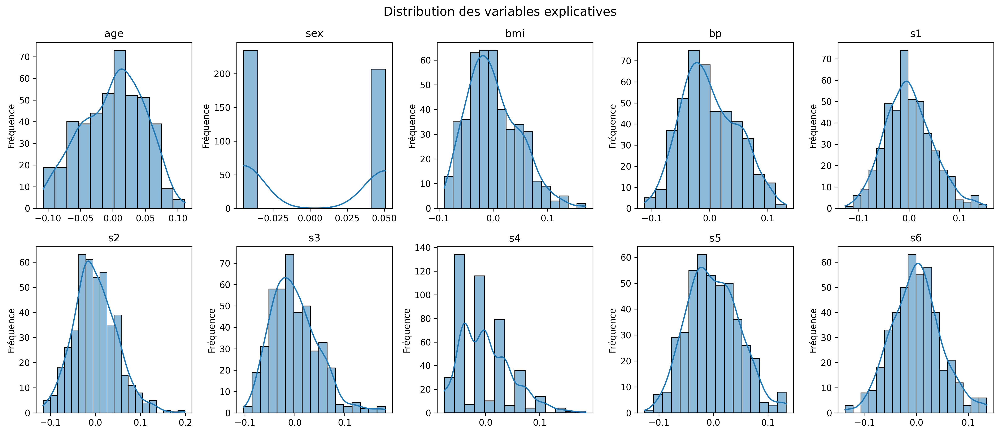
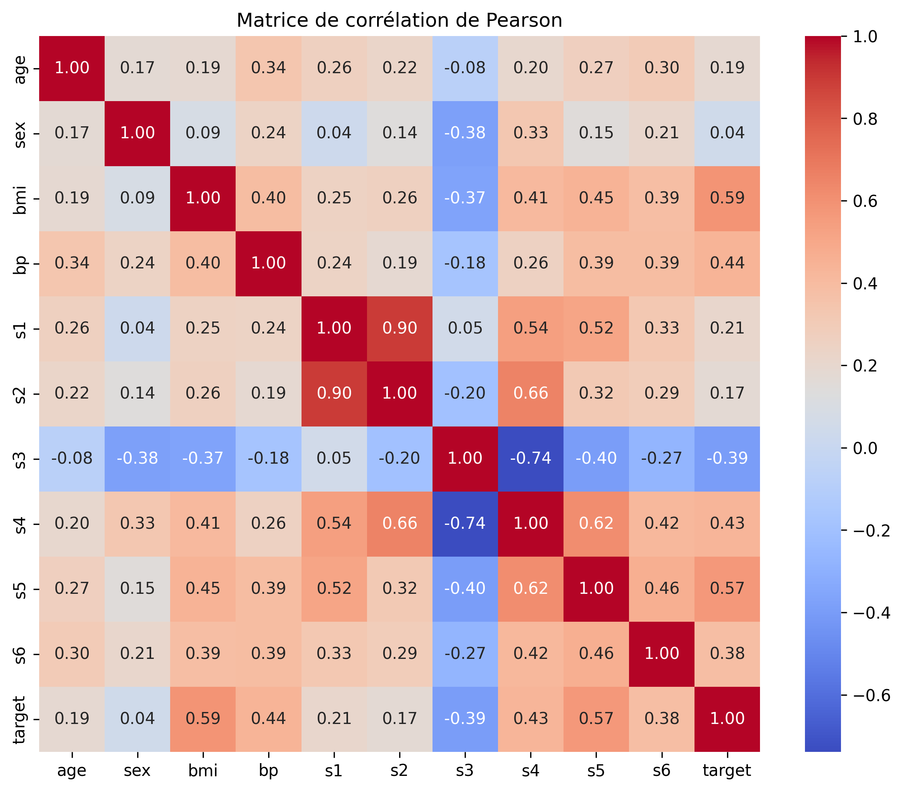
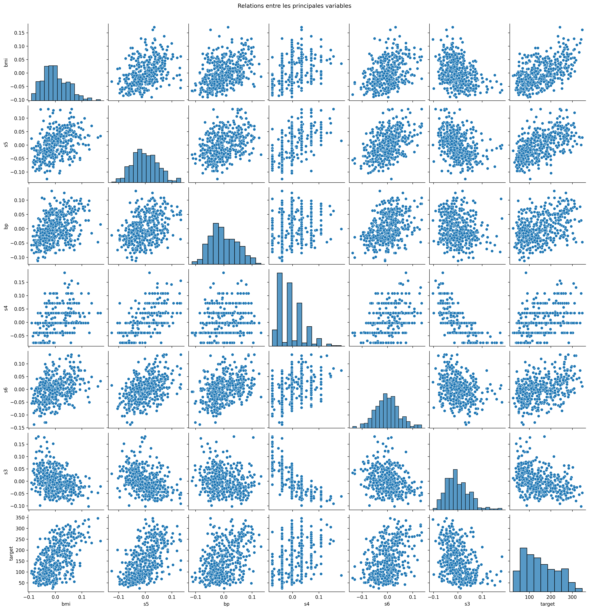
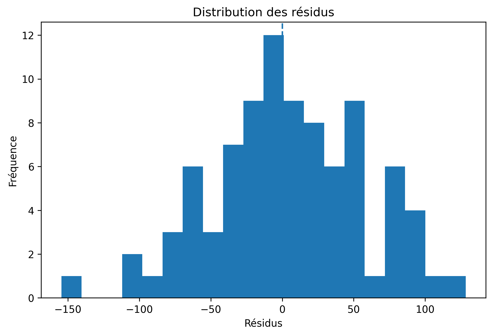
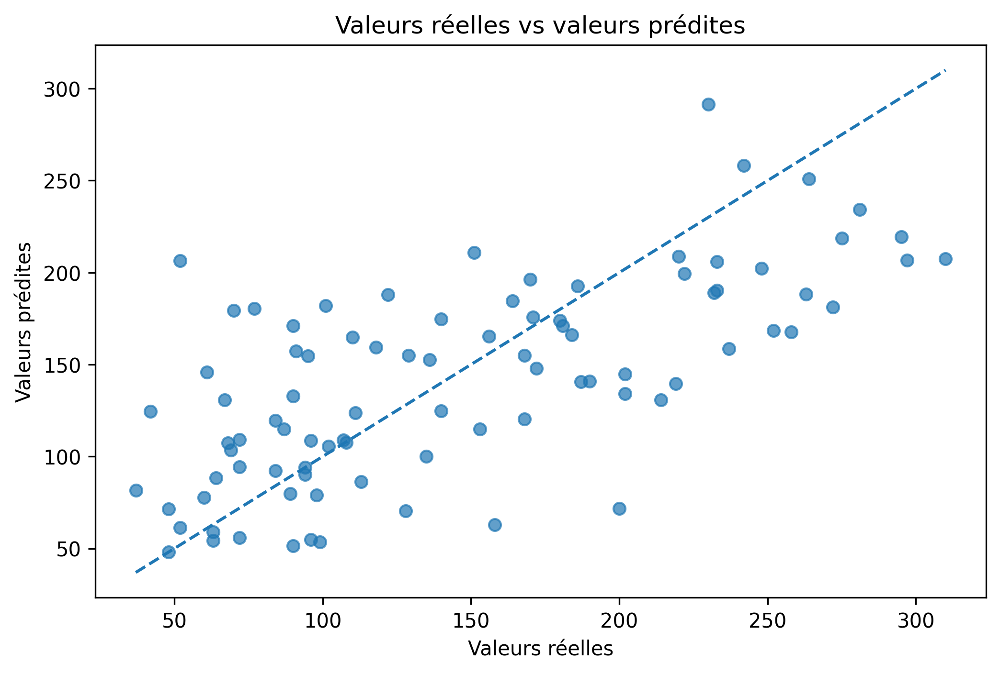
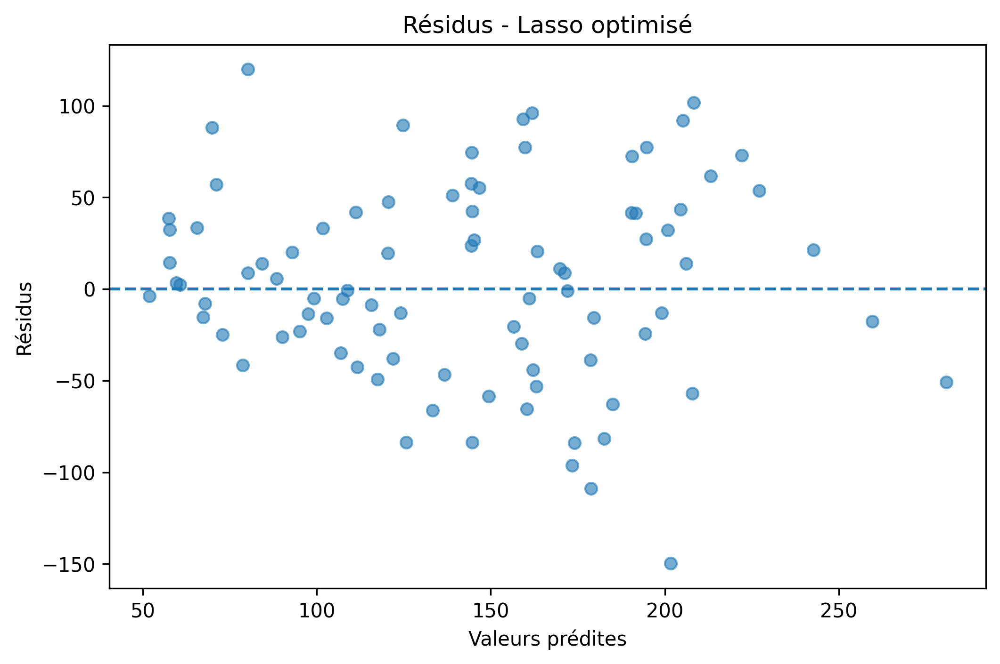
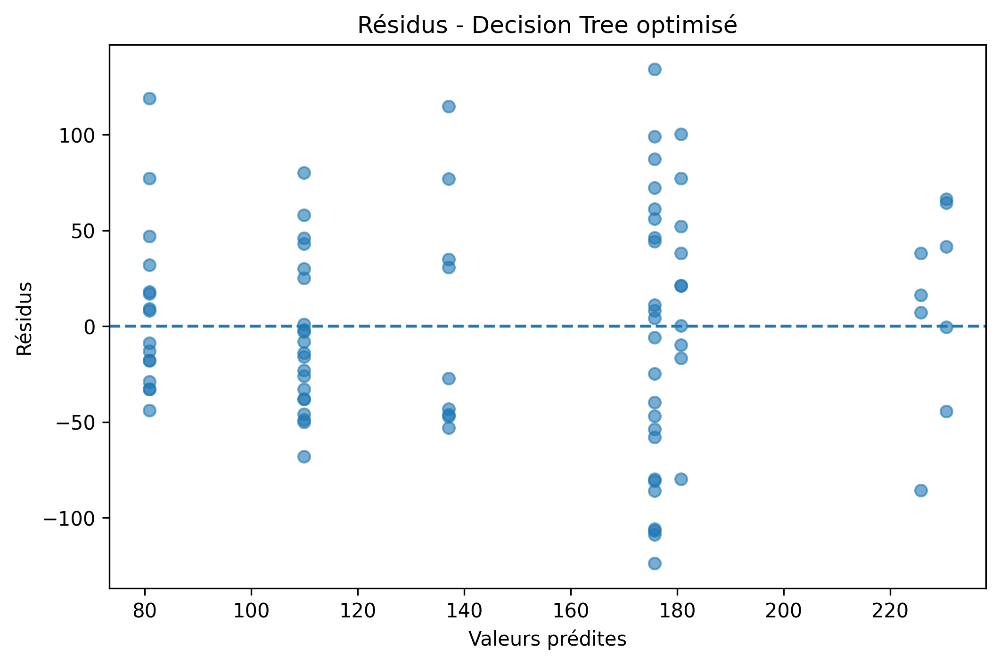
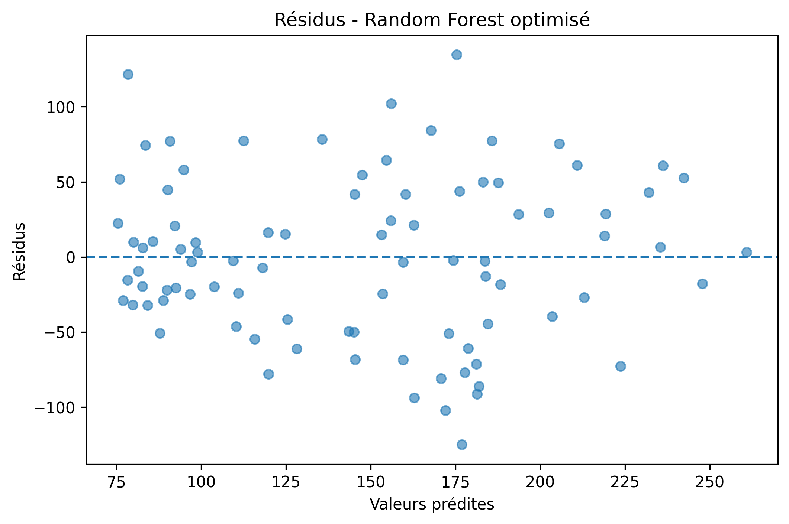
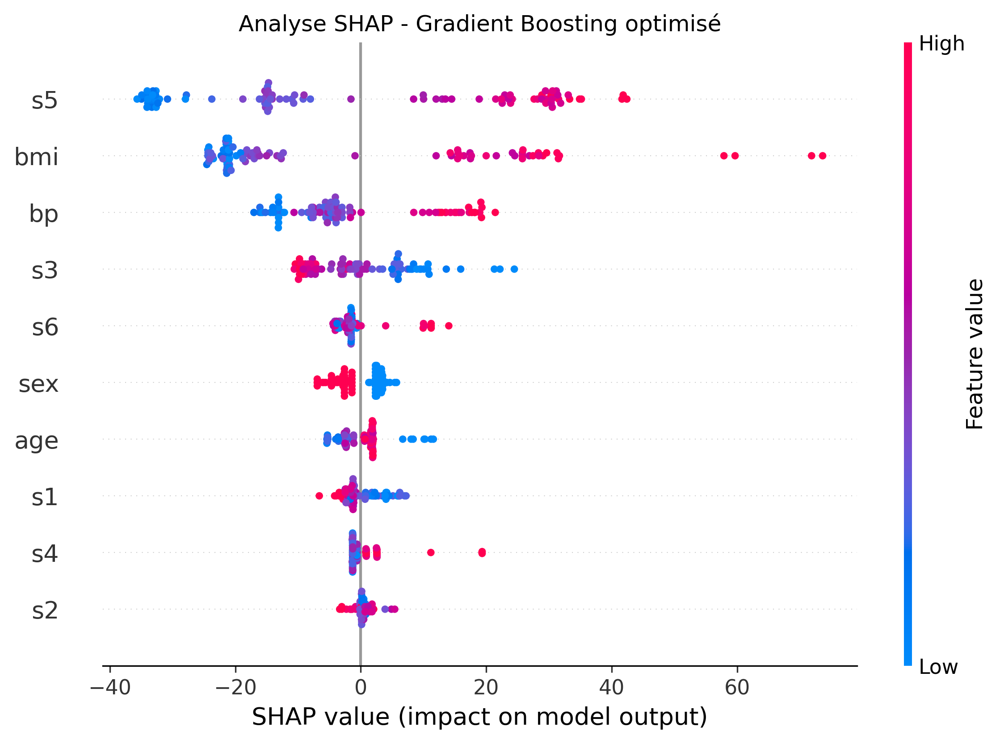

# 🩺 Prédiction de la progression du diabète avec le Machine Learning

## 📌 Présentation du projet

Ce projet porte sur la **prédiction de la progression du diabète** à partir de variables cliniques à l'aide de méthodes de **régression supervisée**.

L'étude utilise le **Diabetes dataset de scikit-learn**, composé de **442 observations et 10 variables explicatives**. Plusieurs familles de modèles sont comparées afin d'identifier l'approche offrant le meilleur compromis entre performance prédictive et capacité de généralisation.

La démarche suivie couvre l'ensemble du processus de modélisation :

**Exploration des données → Analyse statistique → Préparation → Modélisation → Optimisation → Évaluation → Diagnostic → Interprétation → Comparaison**

L'objectif n'est pas uniquement d'obtenir une bonne performance prédictive, mais également de comprendre les limites du modèle et la contribution des différentes variables.

---

## 🎯 Objectifs

Les objectifs de cette étude sont les suivants :

- Explorer la structure et la distribution des données.
- Étudier les relations entre les variables explicatives et la variable cible.
- Identifier les éventuels problèmes de multicolinéarité.
- Préparer les données pour la modélisation.
- Comparer plusieurs algorithmes de régression.
- Optimiser les hyperparamètres avec `GridSearchCV`.
- Évaluer les modèles sur un jeu de test indépendant.
- Analyser les résidus afin d'identifier d'éventuelles anomalies.
- Étudier l'importance des variables.
- Utiliser SHAP pour interpréter les prédictions du modèle final.
- Sélectionner le modèle présentant le meilleur compromis entre performance et généralisation.

---

# 📊 1. Exploration et analyse des données

## 1.1 Jeu de données

Le projet utilise le **Diabetes dataset** disponible dans `scikit-learn`.

Le jeu de données contient :

- **442 observations**
- **10 variables explicatives**
- **1 variable cible** représentant une mesure quantitative de la progression de la maladie.

Les variables explicatives sont :

| Variable | Description |
|---|---|
| `age` | Âge du patient |
| `sex` | Sexe |
| `bmi` | Indice de masse corporelle |
| `bp` | Pression artérielle |
| `s1` | Mesure biologique 1 |
| `s2` | Mesure biologique 2 |
| `s3` | Mesure biologique 3 |
| `s4` | Mesure biologique 4 |
| `s5` | Mesure biologique 5 |
| `s6` | Mesure biologique 6 |

> **Remarque :** les variables du dataset de scikit-learn sont standardisées et ne doivent pas être interprétées directement comme des unités cliniques brutes.

---

## 1.2 Analyse univariée

L'analyse univariée permet d'étudier séparément la distribution de la variable cible et des variables explicatives.

### Distribution de la progression du diabète


La distribution de la variable cible présente une dispersion importante. Cette variabilité constitue un élément important à prendre en compte lors de l'évaluation des performances des modèles.

### Distribution des variables explicatives



Les variables explicatives présentent des distributions différentes. Cette observation justifie notamment l'utilisation d'une standardisation pour les modèles linéaires régularisés.

### Boxplots


Les boxplots permettent d'observer la dispersion des variables et d'identifier les observations situées dans les régions extrêmes de leurs distributions.

---

# 🔎 2. Analyse bivariée

## 2.1 Corrélations avec la variable cible

L'analyse de corrélation de Pearson permet d'identifier les associations linéaires entre les variables explicatives et la progression du diabète.

Les principales corrélations observées avec la cible sont :

| Variable | Corrélation de Pearson |
|---|---:|
| `bmi` | **0,586** |
| `s5` | **0,566** |
| `bp` | **0,441** |
| `s4` | **0,430** |
| `s6` | **0,382** |
| `s3` | **-0,395** |
| `s1` | 0,212 |
| `age` | 0,188 |
| `s2` | 0,174 |
| `sex` | 0,043 |

Le `bmi` et `s5` présentent les associations linéaires positives les plus importantes avec la cible, tandis que `s3` présente une association négative relativement marquée.

Ces corrélations décrivent des **associations statistiques**. Elles ne permettent pas d'établir une relation causale.



## 2.2 Relations entre les principales variables

Un pairplot a été utilisé pour examiner simultanément les relations entre les variables présentant les associations les plus importantes avec la cible.



---

# ⚠️ 3. Multicolinéarité

L'analyse du **Variance Inflation Factor (VIF)** met en évidence une forte multicolinéarité entre plusieurs variables biologiques.

Les valeurs observées sont notamment :

| Variable | VIF |
|---|---:|
| `s1` | **59,20** |
| `s2` | **39,19** |
| `s3` | **15,40** |
| `s5` | **10,08** |
| `s4` | **8,89** |
| `bmi` | 1,51 |
| `s6` | 1,48 |
| `sex` | 1,28 |
| `age` | 1,22 |

Cette forte multicolinéarité constitue un élément important dans l'interprétation des modèles linéaires.

Elle justifie notamment l'étude de modèles régularisés tels que **Ridge, Lasso et Elastic Net**.

---

# ⚙️ 4. Préparation des données

Les données ont été séparées en deux ensembles :

- **80 % pour l'entraînement**
- **20 % pour le test**

La séparation utilise `random_state=42` afin de garantir la reproductibilité des résultats.

Les modèles sensibles à l'échelle des variables, notamment les modèles linéaires régularisés, utilisent une standardisation avec `StandardScaler`.

La sélection des hyperparamètres est réalisée avec :

- `GridSearchCV`
- **validation croisée à 5 plis**
- optimisation sur le jeu d'entraînement uniquement.

Le jeu de test est conservé séparément afin d'obtenir une estimation indépendante des performances finales.

---

# 🤖 5. Modélisation

Plusieurs familles de modèles ont été étudiées.

## 5.1 Modèles linéaires

- Régression linéaire
- Ridge
- Lasso
- Elastic Net

Ces modèles constituent des références importantes pour mesurer la capacité des approches linéaires à expliquer la progression du diabète.

## 5.2 Modèles non linéaires

- Decision Tree Regressor
- Random Forest Regressor
- Gradient Boosting Regressor
- XGBoost Regressor

Ces modèles permettent de capturer des relations non linéaires et des interactions entre les variables que les modèles linéaires peuvent difficilement représenter.

---

# 🔧 6. Optimisation des hyperparamètres

Les modèles ont été optimisés à l'aide de `GridSearchCV` avec une validation croisée à 5 plis.

Les recherches ont notamment porté sur :

- `alpha` pour Ridge et Lasso ;
- `alpha` et `l1_ratio` pour Elastic Net ;
- `max_depth` et `min_samples_leaf` pour Decision Tree ;
- `n_estimators` et les paramètres de régularisation pour Random Forest ;
- `learning_rate`, `n_estimators` et `max_depth` pour Gradient Boosting ;
- `learning_rate`, `n_estimators`, `max_depth`, `subsample` et `colsample_bytree` pour XGBoost.

L'objectif de cette optimisation est d'obtenir des modèles correctement ajustés sans utiliser le jeu de test pour sélectionner les hyperparamètres.

---

# 📉 7. Diagnostic des modèles

L'analyse des résidus permet d'étudier les erreurs de prédiction et de vérifier si elles présentent des structures particulières.

Les visualisations disponibles couvrent les différents modèles étudiés :

### Régression linéaire






### Ridge


### Lasso



### Elastic Net


### Decision Tree



### Random Forest



### Gradient Boosting


### XGBoost


---

# 🏆 8. Comparaison des modèles

Les modèles sont comparés à l'aide de trois métriques principales :

### MAE

Le **Mean Absolute Error (MAE)** mesure l'erreur absolue moyenne entre les valeurs réelles et les valeurs prédites.

**Plus le MAE est faible, meilleur est le modèle.**

### RMSE

Le **Root Mean Squared Error (RMSE)** pénalise davantage les erreurs importantes.

**Plus le RMSE est faible, meilleur est le modèle.**

### R²

Le **coefficient de détermination R²** mesure la proportion de variance de la cible expliquée par le modèle.

**Plus le R² est élevé, meilleur est le modèle.**

Le R² obtenu sur le jeu de test est comparé au R² moyen obtenu en validation croisée afin d'apprécier la stabilité des performances.

---

# 🥇 9. Modèle retenu

Après comparaison des modèles étudiés, le **Gradient Boosting Regressor optimisé** a été retenu comme modèle final dans cette étude.

### Performances sur le jeu de test

| Métrique | Résultat |
|---|---:|
| **MAE** | **42,52** |
| **RMSE** | **52,48** |
| **R² Test** | **0,480** |
| **R² CV** | **0,413** |

Le modèle explique ainsi environ **48 % de la variabilité de la cible sur le jeu de test**.

Le R² moyen obtenu en validation croisée est inférieur au R² observé sur le jeu de test. Cette différence montre que les performances dépendent en partie de l'échantillon utilisé et invite à rester prudent dans l'interprétation de la performance finale.

> **Important :** le modèle présente une performance correcte mais ne permet pas d'expliquer l'ensemble de la variabilité de la progression du diabète. Il ne doit donc pas être considéré comme un modèle clinique destiné à la prise de décision médicale.

---

# 🧠 10. Interprétation du modèle

## 10.1 Importance des variables

L'importance des variables du Gradient Boosting indique que les variables les plus utilisées par le modèle sont principalement :

1. `bmi`
2. `s5`
3. `bp`
4. `s3`


Le `bmi` apparaît comme la variable la plus importante selon l'importance calculée par le modèle, suivi notamment de `s5`, `bp` et `s3`.

Cette mesure indique quelles variables contribuent le plus aux décisions du modèle. Elle ne signifie cependant pas qu'une variable est nécessairement la cause de l'évolution de la cible.

---

## 10.2 Analyse SHAP

L'analyse **SHAP (SHapley Additive exPlanations)** permet d'aller plus loin en étudiant la contribution des variables aux prédictions du modèle.

Dans le graphique SHAP :

- une valeur SHAP positive contribue à augmenter la prédiction ;
- une valeur SHAP négative contribue à diminuer la prédiction ;
- l'amplitude de la valeur SHAP indique l'importance de la contribution pour une observation donnée ;
- la couleur représente généralement la valeur de la variable.



L'analyse met notamment en évidence le rôle important de `bmi`, `s5`, `bp` et `s3` dans les prédictions du modèle.

Il faut toutefois distinguer **importance prédictive** et **causalité**. Une variable fortement contributive aux prédictions n'est pas nécessairement une cause directe de la progression de la maladie.

---

# ⚖️ 11. Interprétation générale des résultats

Les résultats montrent une différence importante entre les modèles linéaires et les modèles capables de représenter des relations non linéaires.

Les modèles linéaires constituent des références utiles, mais leur capacité explicative reste limitée dans ce contexte. Les modèles basés sur les arbres permettent de mieux capturer les relations complexes présentes dans les données.

Le Gradient Boosting optimisé obtient ici le meilleur compromis observé dans l'étude selon les performances retenues pour la comparaison.

Cependant, son **R² de 0,480 sur le jeu de test** signifie qu'une part importante de la variabilité de la cible reste inexpliquée.

Il serait donc incorrect de présenter ce modèle comme une solution prédictive parfaite. Les résultats doivent plutôt être interprétés comme une démonstration de la capacité des méthodes de Machine Learning à modéliser une partie de la variabilité de la progression du diabète dans ce dataset.

---

# ⚠️ 12. Limites de l'étude

Plusieurs limites doivent être prises en compte :

- Le dataset ne contient que **442 observations**.
- Les performances peuvent varier selon la séparation entraînement/test.
- Le R² test de **0,480** montre qu'une part importante de la variabilité reste inexpliquée.
- Les variables du dataset sont standardisées et ne correspondent pas directement à des unités cliniques brutes.
- La forte multicolinéarité entre certaines variables biologiques complique l'interprétation des modèles linéaires.
- Les performances obtenues sur ce dataset ne peuvent pas être automatiquement généralisées à une population différente.
- L'importance des variables et les valeurs SHAP décrivent le fonctionnement du modèle, mais ne démontrent pas de relations causales.
- Le modèle a été développé dans un objectif pédagogique et analytique et ne constitue pas un outil de diagnostic ou de décision médicale.

---

# 🏁 13. Conclusion

Cette étude avait pour objectif de prédire la progression du diabète à partir de dix variables explicatives du **Diabetes dataset de scikit-learn**.

Une démarche complète de Machine Learning supervisé a été mise en œuvre, depuis l'exploration des données jusqu'à l'interprétation du modèle final.

Plusieurs algorithmes ont été comparés, notamment :

- Régression linéaire ;
- Ridge ;
- Lasso ;
- Elastic Net ;
- Decision Tree ;
- Random Forest ;
- Gradient Boosting ;
- XGBoost.

Les hyperparamètres ont été optimisés avec `GridSearchCV` et une validation croisée à 5 plis.

Dans cette étude, le **Gradient Boosting Regressor optimisé** a obtenu les meilleures performances retenues, avec :

- **MAE : 42,52**
- **RMSE : 52,48**
- **R² Test : 0,480**
- **R² CV : 0,413**

L'interprétation du modèle montre que `bmi`, `s5`, `bp` et `s3` jouent un rôle important dans ses prédictions.

Ces résultats montrent l'intérêt des méthodes non linéaires pour ce problème, tout en soulignant leurs limites. Le modèle n'explique qu'une partie de la variabilité de la cible et doit donc être considéré comme un modèle prédictif exploratoire plutôt que comme un outil clinique.

---

# 🛠️ Technologies utilisées

- **Python**
- **Pandas**
- **NumPy**
- **Matplotlib**
- **Seaborn**
- **Scikit-learn**
- **XGBoost**
- **SHAP**
- **Jupyter Notebook**

---

# 📂 Structure du projet

```text
01_Prediction_progression_diabete/
│
├── README.md
│
├── Prédiction de la progression du diabète.ipynb
│
└── Visuels_Projet/
    │
    ├── 01_eda_univariee/
    │   ├── 01_distribution_progression_diabete.png
    │   ├── 02_boxplots_variables.png
    │   └── 03_distribution_variables_explicatives.png
    │
    ├── 02_eda_bivariee/
    │   ├── 01_matrice_correlation_pearson.png
    │   └── 02_pairplot_variables_principales.png
    │
    ├── 03_diagnostic_modeles/
    │   ├── 01_residus_regression_lineaire.png
    │   ├── 02_distribution_residus_regression_lineaire.png
    │   ├── 03_reelles_vs_predites_regression_lineaire.png
    │   ├── 04_ridge.png
    │   ├── 05_lasso.png
    │   ├── 06_elastic_net.png
    │   ├── 07_decision_tree.png
    │   ├── 08_random_forest.png
    │   ├── 09_gradient_boosting.png
    │   └── 10_xgboost.png
    │
    └── 05_interpretation/
        ├── 01_importance_variables_gradient_boosting.png
        └── 02_shap_summary_gradient_boosting.png
```

---

# 👤 Auteur

**Fabrice**

Projet réalisé dans le cadre de l'apprentissage du **Machine Learning supervisé, de la régression et de l'interprétabilité des modèles**.