# Predicting Aerodynamic Noise from Airfoil Operating Conditions

## 1. Présentation

Ce projet s'inscrit dans un portfolio de Data Science visant à démontrer une démarche complète : compréhension du problème, analyse exploratoire, tests d'hypothèses statistiques, feature engineering, modélisation et interprétation. Il s'appuie sur des données d'essais NASA en soufflerie sur des profils d'aile (NACA 0012).

## 2. Problématique

Peut-on prédire le niveau sonore aérodynamique (SSPL, en décibels) d'un profil d'aile à partir de ses caractéristiques physiques et des conditions d'écoulement ?

## 3. Dataset

**NASA Airfoil Self-Noise Dataset** (Brooks, Pope & Marcolini, 1989)  
Source : [Kaggle](https://www.kaggle.com/datasets/fedesoriano/airfoil-selfnoise-dataset)

- 1503 observations, 5 variables explicatives + 1 variable cible
- Issu d'un plan d'expérience factoriel en soufflerie (pas de données observationnelles) : 6 longueurs de corde, 4 vitesses de flux testées

| Variable | Description | Unité |
|---|---|---|
| f | Fréquence | Hz |
| alpha | Angle d'attaque | ° |
| c | Longueur de corde | m |
| U_infinity | Vitesse du flux libre | m/s |
| delta | Épaisseur de déplacement (couche limite) | m |
| **SSPL** (cible) | Niveau de pression sonore | dB |

## 4. Objectifs

- Comparer plusieurs familles de modèles de régression (linéaires, régularisés, à base d'arbres) pour prédire SSPL
- Identifier les variables physiques les plus déterminantes
- Documenter rigoureusement les choix méthodologiques et les limites

## 5. Questions métier/scientifiques

1. Quelles variables physiques sont les plus associées à SSPL ?
2. Ces relations sont-elles linéaires ou non linéaires ?
3. Comment les conditions expérimentales (c, U_infinity) influencent-elles SSPL ?
4. Existe-t-il des interactions entre variables physiques sur SSPL ?

## 6. Hypothèses statistiques

Pour chaque variable, hypothèse de départ formulée avant analyse :  
alpha, U_infinity et delta devraient avoir une influence positive sur SSPL (plus de turbulence = plus de bruit) ; f et c, une relation plus complexe et potentiellement non linéaire.

## 7. Data Cleaning

- Aucune valeur manquante, aucun doublon détecté
- Aucune valeur supprimée : les "outliers" identifiés visuellement au boxplot (f > 8000 Hz, delta > 0,035) ont été vérifiés et confirmés comme des mesures expérimentales valides et répétées (échelle normalisée en tiers d'octave pour f ; combinaisons légitimes de c/alpha/U_infinity pour delta), pas des anomalies

## 8. EDA (Analyse exploratoire)

### Boxplots des variables

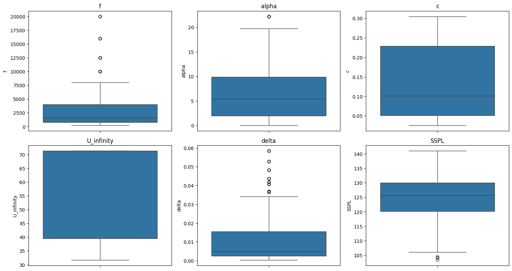

### Distribution des variables

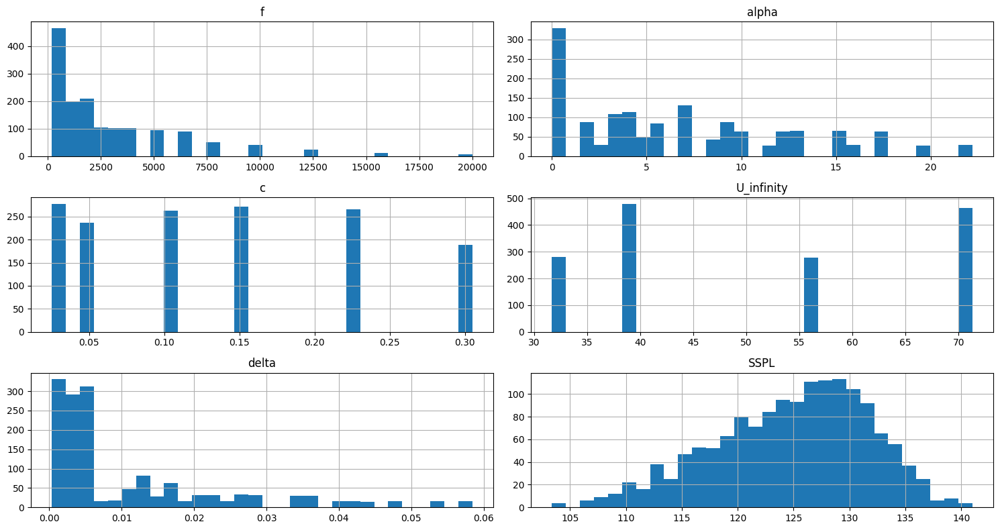

### Matrice de corrélation

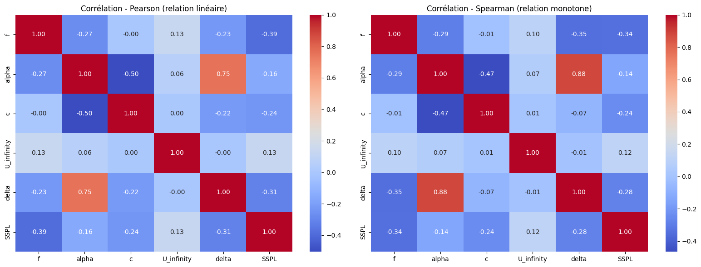

### Boxplots de c et U_infinity en fonction de SSPL

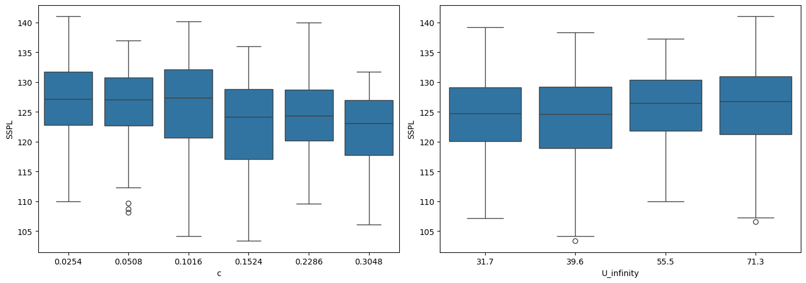

### Relation entre f et SSPL

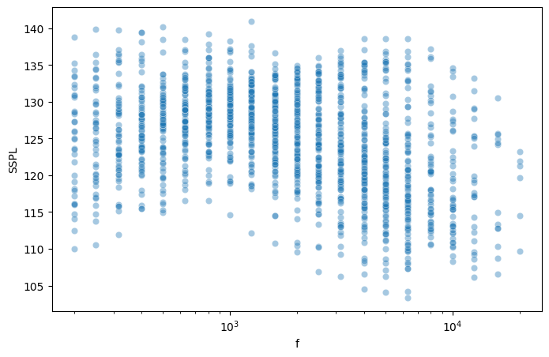


### Boxplots des variables


### Distribution des variables


### Matrice de corrélation


### Boxplots de c et U_infinity en fonction de SSPL


### Relation entre f et SSPL


- f et delta sont fortement asymétriques à droite ; SSPL suit une distribution proche de la normale
- c (6 valeurs) et U_infinity (4 valeurs) se comportent comme des variables quasi-catégorielles (plan d'expérience)
- Corrélations avec SSPL (Pearson) : f = -0,39, delta = -0,31, c = -0,24, alpha = -0,16, U_infinity = +0,13. Aucune variable dominante isolément
- La relation f/SSPL est non monotone (forme en cloche), non capturée par Pearson/Spearman
- Multicolinéarité notable entre alpha et delta (Pearson = 0,75)

## 9. Tests statistiques

| Test | Variables | Résultat | Effet |
|---|---|---|---|
| Shapiro-Wilk + Levene | SSPL par groupe de c | Normalité et homogénéité rejetées | — |
| Kruskal-Wallis | c vs SSPL | H=102,92, p<0,001 | ε²=0,065 (faible) |
| Dunn (Holm) post-hoc | c vs SSPL | 10/15 paires significatives | Effet de palier autour de c≈0,13 |
| Kruskal-Wallis | U_infinity vs SSPL | H=27,24, p<0,001 | ε²=0,016 (faible) |
| Pearson/Spearman | f, alpha, delta vs SSPL | p<0,001 pour les 3 | Modéré à faible |

Conclusion : toutes les variables ont un effet statistiquement significatif sur SSPL, mais aucune n'est dominante isolément. La significativité (due en partie à la taille de l'échantillon) doit être distinguée de l'ampleur de l'effet (toujours faible à modérée ici).

## 10. Feature Engineering

### Relation entre Re et SSPL

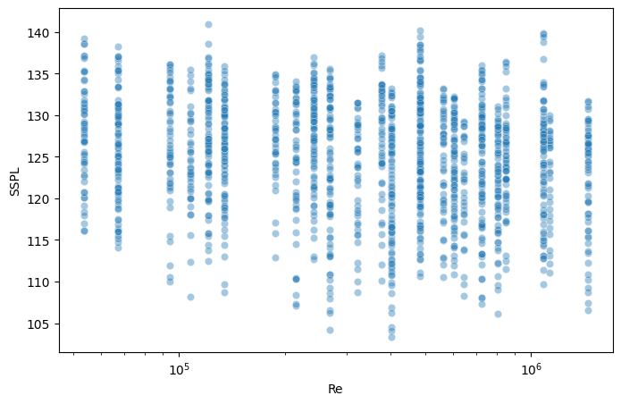

### Distribution de log_f

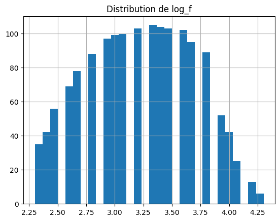


### Relation entre Re et SSPL


### Distribution de log_f


- **log_f** : transformation logarithmique de f, retenue pour réduire son asymétrie (std/mean passe de 1,09 à 0,15)
- **c_high** (seuil à 0,13) : exploré puis abandonné. Seuil déterminé en observant la relation avec SSPL (risque de data leakage), sans justification physique indépendante
- **Re** (nombre de Reynolds) : exploré comme alternative physiquement justifiée (Brooks, Pope & Marcolini, 1989), mais abandonné. Corrélation plus faible que c seule (r=-0,16 vs r=-0,24) et VIF catastrophique (colinéarité directe avec c et U_infinity)
- **Variables finales retenues** : log_f, alpha, c, U_infinity, delta
- **VIF final** (après correction de la méthode de calcul, ajout de la constante) : toutes les variables < 5. Aucune multicolinéarité problématique

## 11. Modèles testés

| Modèle | MAE | RMSE | R² test | R² CV |
|---|---:|---:|---:|---:|
| Linear Regression | 3,845 | 4,874 | 0,526 | — |
| Ridge | 3,846 | 4,875 | 0,526 | — |
| Lasso (optimisé) | 3,846 | 4,875 | 0,526 | — |
| Random Forest (optimisé) | 1,308 | 1,825 | 0,934 | 0,922 |
| Gradient Boosting (optimisé) | 0,951 | 1,442 | 0,958 | 0,948 |
| **XGBoost (optimisé)** | **0,874** | **1,380** | **0,962** | **0,947** |

## 12. Méthodologie de validation

- Split train/test 80/20 (aléatoire), justifié par l'absence de doublons et la nature interpolative du problème (pas d'entité "individu" répétée)
- Cross-validation à 5 folds pour la robustesse des scores
- Recherche d'hyperparamètres (RandomizedSearchCV) réalisée uniquement sur le train, jeu de test utilisé une seule fois par modèle pour l'évaluation finale

## 13. Résultats

Modèle final retenu : **XGBoost optimisé**  
(n_estimators=500, max_depth=6, learning_rate=0.2, subsample=0.9, colsample_bytree=0.9)

- R² test = 0,962 (96,2 % de variance expliquée)
- MAE = 0,874 dB, RMSE = 1,380 dB
- Écart train/test = 0,038 (surapprentissage limité)

## 14. Interprétation

### Analyse des résidus

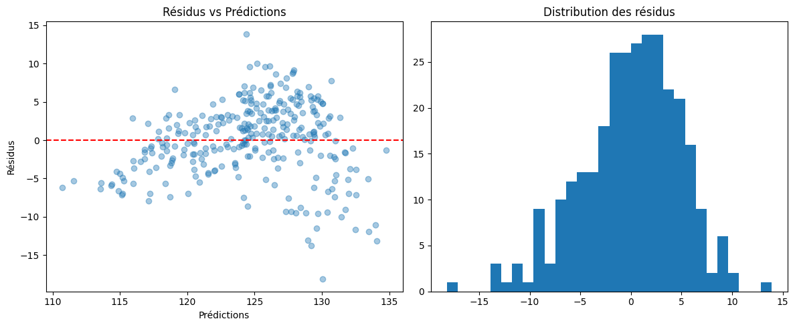

### Feature importance

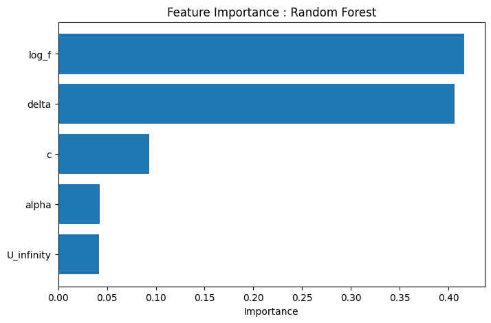

### Résidus du modèle XGBoost optimisé

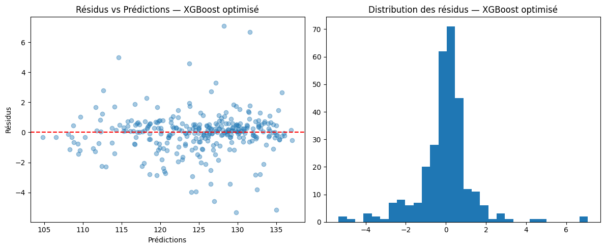

### Analyse SHAP

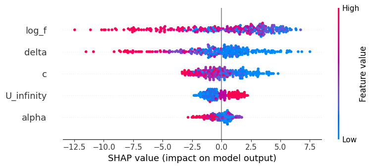


### Analyse des résidus


### Feature importance


### Résidus du modèle XGBoost optimisé


### Analyse SHAP


Analyse des résidus : centrés sur zéro, sans structure ni hétéroscédasticité marquée. Les erreurs les plus importantes se concentrent sur les configurations extrêmes du plan d'expérience (angle d'attaque élevé, corde minimale), ce qui est cohérent avec leur sous-représentation dans les données (75e percentile d'alpha à seulement 9,9° pour un maximum de 22,2°).

Analyse SHAP : log_f est la variable la plus influente (fréquence élevée → bruit prédit plus faible), suivie de delta, puis c. alpha et U_infinity ont un impact plus limité. Ce classement est cohérent avec la feature importance de Random Forest et les corrélations mesurées lors des tests statistiques.

## 15. Limites

- Le modèle est validé par interpolation à l'intérieur du plan d'expérience testé (6 longueurs de corde, 4 vitesses) ; sa capacité à extrapoler à des configurations physiques non testées n'est pas démontrée
- Précision réduite aux valeurs extrêmes d'alpha et de c minimal, par sous-représentation dans les données d'entraînement
- delta est une variable dérivée de c, alpha et U_infinity : son importance élevée dans le modèle ne doit pas être interprétée comme un effet physique totalement indépendant

## 16. Recommandations

- Pour un usage en pré-dimensionnement acoustique, privilégier les configurations proches du centre du plan d'expérience testé
- Enrichir le dataset avec des essais à angle d'attaque élevé améliorerait la fiabilité du modèle sur cette plage
- Explorer les interactions SHAP (notamment log_f × delta) pour affiner la compréhension du modèle

## 17. Technologies

Python, Pandas, NumPy, SciPy, Statsmodels, Scikit-learn, XGBoost, SHAP, Matplotlib, Seaborn

## 18. Installation

```bash
git clone <url-du-repo>
cd airfoil-self-noise-prediction
pip install -r requirements.txt
```

## 19. Reproductibilité

Tous les modèles utilisent `random_state=42`. Notebooks organisés selon la structure :  
`01_data_understanding` → `02_eda` → `03_hypothesis_testing` → `04_feature_engineering` → `05_modeling` → `06_evaluation`.

## 20. Sources

- Brooks, T.F., Pope, D.S., Marcolini, M.A. (1989). *Airfoil Self-Noise and Prediction*. NASA RP-1218.
- Dataset : [Kaggle - fedesoriano](https://www.kaggle.com/datasets/fedesoriano/airfoil-selfnoise-dataset)