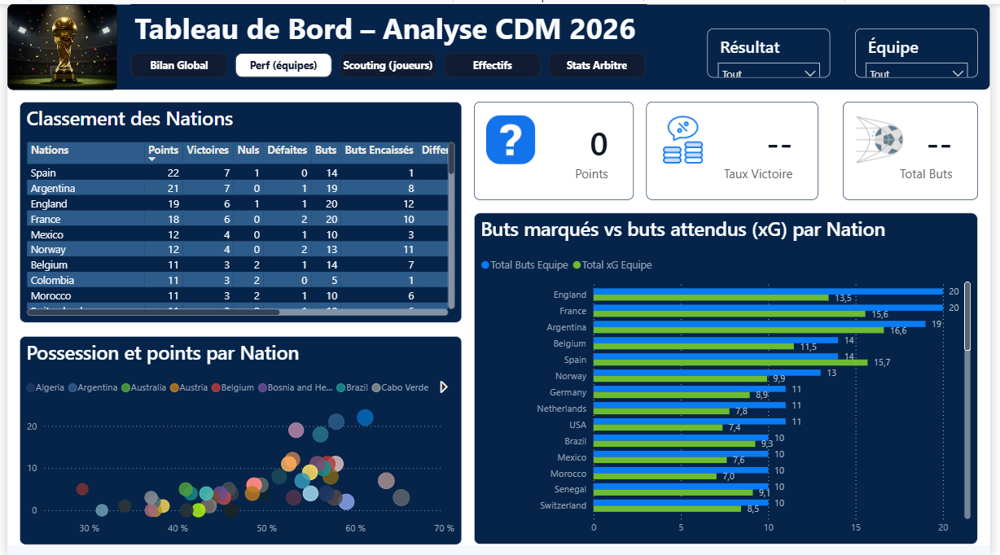
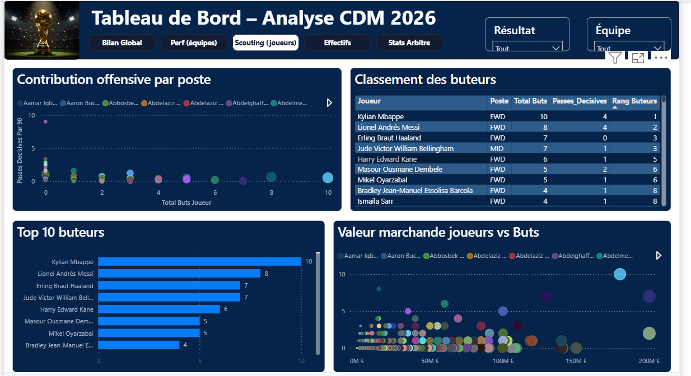

# 🏆 Analyse Coupe du Monde FIFA 2026 | Football Analytics

## 🎯 Objectif

Construire un dashboard Power BI professionnel de **Football Analytics** sur la Coupe du Monde FIFA 2026 (48 équipes, 104 matchs, 12 groupes de 4), destiné à un usage portfolio Data Analyst / BI.

**Périmètre analytique :**

* Performances des équipes (attaque, défense, possession)
* Performances individuelles des joueurs
* Résultats de matchs, xG, tirs et occasions
* Parcours dans la compétition (phases de groupes → finale)
* Comparaisons et tendances entre équipes et joueurs

**Parties prenantes ciblées :** analyste sportif / staff technique, recruteur, journaliste sportif, direction sportive. Chacun dispose d'une page dédiée répondant à ses besoins d'analyse.

## 🧩 Contexte

Projet mené avec une démarche d'audit rigoureuse : **14 fichiers CSV sources** inspectés individuellement avant toute construction du modèle.

Les contrôles ont porté sur la structure, la granularité, l'unicité des clés, les valeurs manquantes, les doublons et la cohérence entre les tables.

Chaque anomalie détectée a été documentée avec son mécanisme, sa méthode de vérification et la décision retenue. La démarche est traçable de bout en bout, incluant une correction post-clôture sur le score de la finale, découverte après confrontation à des sources externes.

## 🔗 Sources de données

* **14 fichiers CSV** : équipes, matchs, statistiques d'équipe par match, effectifs et joueurs, statistiques joueurs, compositions de match, événements de match, arbitres, stades, phases de tournoi et 3 fichiers orientés Machine Learning hors périmètre BI.
* **Volumes principaux** : 48 équipes, 104 matchs, 1 248 joueurs convoqués, 5 408 lignes de composition, 601 événements de match, 28 arbitres et 16 stades.
* **Limites de données** : absence de statistiques défensives avancées telles que les tacles et interceptions. La table `match_events` est structurellement incomplète sur 4 matchs et ne recense qu'une fraction des cartons réels. Elle n'est donc jamais utilisée pour produire un total agrégé, uniquement pour des analyses ponctuelles.

## 📈 KPIs

| KPI                                     | Ce qu'il mesure                                                         |
| --------------------------------------- | ----------------------------------------------------------------------- |
| Total Buts / Moyenne Buts par Match     | Rythme offensif global du tournoi                                       |
| Points, Victoires, Différentiel de buts | Classement et performance globale par équipe                            |
| Buts moins xG                           | Sur/sous-performance de finition par rapport à la qualité des occasions |
| Possession moyenne vs Note Elo          | Analyse de la relation entre possession et niveau des équipes           |
| Rang buteurs, Passes décisives /90      | Classement et contribution offensive des joueurs                        |
| Valeur marchande totale, Âge moyen      | Profil démographique et économique des effectifs                        |
| Fautes moyennes / match, Cartons        | Profil disciplinaire des arbitres                                       |

## 🔍 Analyses réalisées

**Audit et qualité des données**

Traitement méthodique de plusieurs anomalies réelles :

* incohérence de somme de possession sur 24 matchs, corrigée par rescale proportionnel ;
* colonnes structurellement vides (`shots`, `shots_on_target`, `average_rating`) supprimées ;
* doublon fonctionnel entre deux tables de même granularité, avec désactivation du chargement d'une table ;
* relation 1-à-1 détectée entre deux tables d'origine différente puis fusionnées en une table `Joueurs` unique.

**Modélisation en étoile**

Les faits principaux (`Matchs`, `Statistiques_equipes_match`, `Compositions_match`, `Evenements_match`, `Joueurs`) sont reliés à des dimensions communes (`Equipes`, `Arbitres`, `Stades`, `Phases_tournoi`).

Les relations multiples vers `Equipes`, notamment les rôles domicile et extérieur, sont gérées avec des relations actives/inactives et `USERELATIONSHIP`.

**Power Query (M)**

Plusieurs pièges techniques ont été identifiés et corrigés :

* conversion décimale dépendante de la culture régionale avec `en-US` forcé explicitement ;
* conversion du texte `"0"/"1"` vers le type logique en deux étapes ;
* référence circulaire entre requêtes résolue grâce à une requête intermédiaire dédiée.

**DAX**

Les mesures ont été conçues pour gérer correctement :

* les rôles domicile et extérieur avec `ALL(Matchs)` et `FILTER` ;
* la propagation du blanc dans les multiplications avec `COALESCE` ;
* les problèmes de produit cartésien dans certains visuels combinant plusieurs champs identifiants.

**Correction post-clôture**

Une erreur de score sur la finale Espagne-Argentine a été détectée après la clôture initiale du projet.

La vérification a été effectuée à partir de 3 sources externes indépendantes et concordantes. La correction a ensuite été appliquée en Power Query avec une colonne conditionnelle ciblée sur la clé du match concerné.

Un audit complémentaire des demi-finales et du match pour la 3e place a confirmé que l'anomalie était isolée.

**Storytelling**

La relation entre possession et résultat a fait l'objet d'une analyse critique.

Trois hypothèses alternatives à une causalité directe ont été formulées et testées :

1. qualité intrinsèque de l'équipe ;
2. niveau de l'adversaire ;
3. causalité inverse liée au score.

Un test empirique basé sur la corrélation entre possession moyenne et classement Elo pré-tournoi donne **r = 0,73**.

## 🛠️ Technologies utilisées

* **Power BI Desktop** : Power Query, modèle de données et DAX
* **Power Query (M)** : audit, nettoyage, transformation et fusion des données
* **DAX** : mesures, colonnes et tables calculées
* **Modélisation en étoile**
* **Thème visuel personnalisé** : `Theme_CDM2026.json`

## 🖼️ Aperçu du dashboard

Le rapport comprend **5 pages**, chacune répondant à une question métier précise.

### Bilan Global

Quel est le bilan global du tournoi ?


### Performance équipes

Quelles équipes ont le mieux performé et pourquoi ?



### Scouting joueurs

Quels sont les joueurs les plus performants ?



### Effectifs

Quel est le profil démographique et économique des effectifs ?


### Stats Arbitre

Le profil d'un arbitre influence-t-il le déroulement des matchs ?


## 💡 Insights clés

* La possession moyenne est fortement corrélée à la force pré-tournoi des équipes selon leur classement Elo (**r = 0,73**). Elle reflète donc principalement le niveau global d'une équipe et ne constitue pas, à elle seule, une preuve de causalité sur la victoire.
* Un écart buts − xG observé sur un tournoi de 3 à 7 matchs par équipe doit être interprété comme une observation descriptive ponctuelle. L'échantillon est trop restreint pour conclure à une capacité durable de finition.
* La complétude structurelle d'une table et l'exactitude de ses valeurs sont deux dimensions différentes de la qualité des données. Une table peut être complète tout en contenant des valeurs incorrectes, comme l'a montré l'erreur détectée sur le score de la finale.

## 📂 Contenu du dossier

```text
analyse-coupe-du-monde-fifa-2026/
├── README.md
├── data/
├── screenshots/
│   ├── 01-bilan-global.png
│   ├── 02-performance-equipes.png
│   ├── 03-scouting-joueurs.png
│   ├── 04-effectifs.png
│   └── 05-stats-arbitre.png
├── documentation/
│   └── Documentation_Methodologique.docx
└── analyse-coupe-du-monde-fifa-2026.pbix
```

> 📝 Le dossier `documentation/` contient le journal de bord complet du projet : audit des 14 tables sources, code Power Query table par table, modélisation en étoile, mesures DAX, conception du dashboard, storytelling, thème visuel et évaluation critique.
