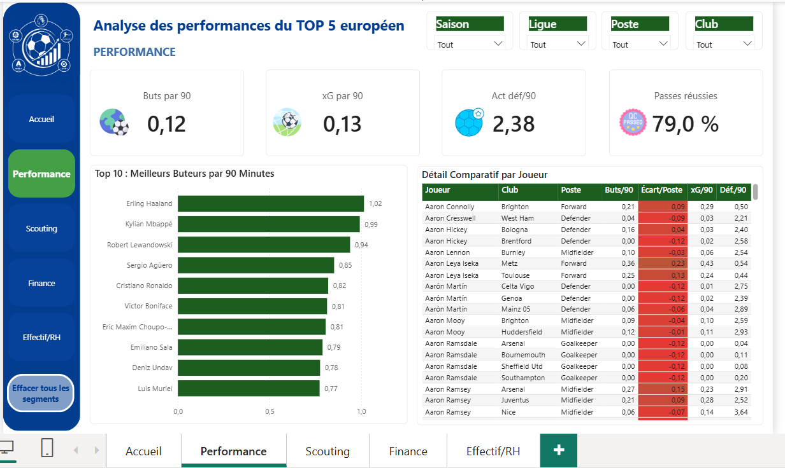
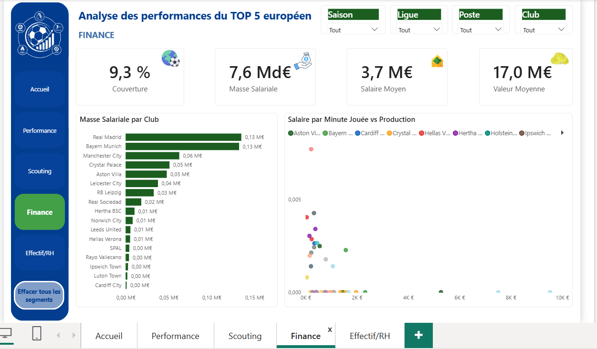
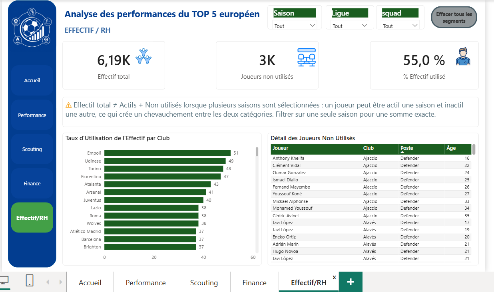

# ⚽ Analyse de Performance, Scouting et Valorisation Financière | Football Européen (Big 5)

## 🎯 Objectif

Construire une **Vue 360°** du football professionnel européen de haut niveau, en combinant trois angles d'analyse dans un même dashboard décisionnel :

* **Performance sportive** : classements, comparaisons et efficacité
* **Scouting & recrutement** : identification de profils sous-cotés
* **Analyse financière** : valeur marchande, masse salariale et retour sur investissement

L'objectif métier est de couvrir ces trois dimensions simultanément sans qu'aucune ne soit sacrifiée au profit d'une autre.

## 🧩 Contexte

Projet réalisé selon une démarche méthodologique structurée : cadrage métier, préparation des données, modélisation, DAX, conception du dashboard et storytelling.

Le secteur analysé, le football professionnel européen, combine deux dimensions rarement réunies dans un même projet : la **performance sportive quantitative** et l'**économie du joueur**, notamment à travers la valeur marchande et les salaires.

## 🔗 Sources de données

* **12 fichiers sources** décrivant les statistiques de joueurs des **5 grands championnats européens** : Premier League, Ligue 1, La Liga, Bundesliga et Serie A, sur la période **2018-2024**.
* Données enrichies avec des statistiques financières : valeur marchande, salaires et frais de transfert pour un **sous-ensemble de 18 clubs sur 144**.
* **Volumes principaux** : environ 19 270 lignes de statistiques de champ, 1 305 lignes pour les gardiens et 2 047 lignes de valorisation financière.
* **Couverture financière partielle** : 18 clubs sur 144. Une mesure DAX dédiée, `% Couverture Valorisation`, est affichée pour éviter toute surinterprétation de cet échantillon.

## 📈 KPIs

| KPI                         | Ce qu'il mesure                                                                       |
| --------------------------- | ------------------------------------------------------------------------------------- |
| Buts + Passes décisives /90 | Production offensive normalisée par le temps de jeu                                   |
| xG/90 et Buts − xG          | Volume d'occasions créées et efficacité de finition                                   |
| % Passes réussies           | Profil du joueur, entre sécurité et prise de risque                                   |
| Actions défensives /90      | Performance défensive des profils concernés                                           |
| Ratio Performance / Valeur  | Identification des joueurs présentant un rapport performance/valorisation intéressant |
| % Effectif utilisé          | Taux d'utilisation réelle de l'effectif sous contrat                                  |
| % Arrêts / Clean sheets     | Indicateurs spécifiques aux gardiens                                                  |

## 🔍 Analyses réalisées

### Modélisation

Le modèle repose sur un schéma en étoile à faits multiples :

* `Fact_Performance` : table de faits principale, environ 171 colonnes, issue de la fusion de 8 tables de statistiques de champ et de temps de jeu.
* `Fact_Performance_GK` : table dédiée aux gardiens.
* `Dim_Joueur`
* `Dim_Club`
* `Dim_Competition`
* `Dim_Saison`
* `Dim_Position`

La table `valuations`, contenant les données financières, est reliée aux tables de faits et non directement aux dimensions.

### Qualité des données

Plusieurs contrôles ont été réalisés :

* déduplication des clés de jointure avec `Table.Distinct` ;
* gestion des homonymes grâce à une clé composite `player + born` ;
* identification de 40 cas d'homonymie confirmés ;
* détection de colonnes dupliquées sous des noms différents, notamment `ga` et `goals_against` ;
* correction d'une cardinalité de relation inversée.

### DAX

Les mesures suivent un principe important :

> **Ne jamais moyenner un ratio déjà calculé.**

Les valeurs brutes du numérateur et du dénominateur sont d'abord agrégées, puis le ratio est calculé avec `DIVIDE()`.

Les écarts à la moyenne du poste utilisent `ALLEXCEPT` afin de conserver des comparaisons dynamiques selon le contexte de filtre.

### Exploration

Plusieurs analyses ont été réalisées :

* corrélation performance / valeur marchande : **0,42** ;
* corrélation âge / performance : **−0,047** ;
* évolution de la valeur marchande selon l'âge ;
* analyse de la volatilité saisonnière de la différence **Buts − xG**.

Les résultats montrent notamment que la surperformance ou sous-performance de finition peut varier fortement d'une saison à l'autre, y compris chez les meilleurs finisseurs.

### Segmentation scouting

Une colonne calculée `Profil Performance Valeur` permet de classer les joueurs selon leur rapport entre production offensive et valeur marchande :

* Fort potentiel sous-coté
* Bon rapport
* Standard
* Rapport faible

Les seuils ont été calibrés à partir des quartiles observés dans la distribution réelle des données.

## 🛠️ Technologies utilisées

* **Power BI Desktop**
* **Power Query (M)**
* **DAX**
* **Modélisation en étoile**

Power Query est utilisé pour l'audit, le nettoyage, la transformation et la fusion des données.

DAX est utilisé pour les mesures, les indicateurs analytiques et les colonnes calculées.

## 🖼️ Aperçu du dashboard

Le rapport comprend **5 pages**, chacune dédiée à un angle métier et à un public décisionnel distinct.

Les filtres globaux **Saison**, **Compétition** et **Position** sont communs à toutes les pages. Le filtre **Club** est utilisé localement sur les pages Performance et Scouting.

### Accueil

Synthèse et état des lieux global.


### Performance

Classements et comparaisons entre joueurs et équipes.



### Scouting

Identification des profils sous-cotés et analyse de la valeur selon l'âge.


### Finance

Analyse de la masse salariale et comparaison entre salaire et production.



### Effectif / RH

Analyse de l'utilisation de l'effectif sous contrat.



## 💡 Insights clés

* La performance et la valeur marchande sont liées, mais de manière modérée avec une corrélation de **0,42**. La valeur d'un joueur ne dépend donc pas uniquement de sa production statistique.
* Le marché accorde une forte importance à la jeunesse. Le pic de valorisation se situe entre **22 et 24 ans**, alors que la performance pure varie beaucoup moins avec l'âge.
* La différence **Buts − xG** est volatile d'une saison à l'autre, y compris chez les meilleurs finisseurs. Elle ne doit donc pas être considérée comme une caractéristique stable d'un joueur sur la base d'une seule saison.

## 📂 Contenu du dossier

```text
analyse-performance-football-europe/
├── README.md
├── data/
├── screenshots/
│   ├── 01-accueil.png
│   ├── 02-performance.png
│   ├── 03-scouting.png
│   ├── 04-finance.png
│   └── 05-effectif-rh.png
├── documentation/
│   └── Documentation_Methodologique.docx
└── analyse-performance-football-europe.pbix
```

> 📝 Le dossier `documentation/` contient le document méthodologique complet : compréhension métier, audit qualité, code Power Query (M), modélisation en étoile, mesures DAX et leurs justifications.
