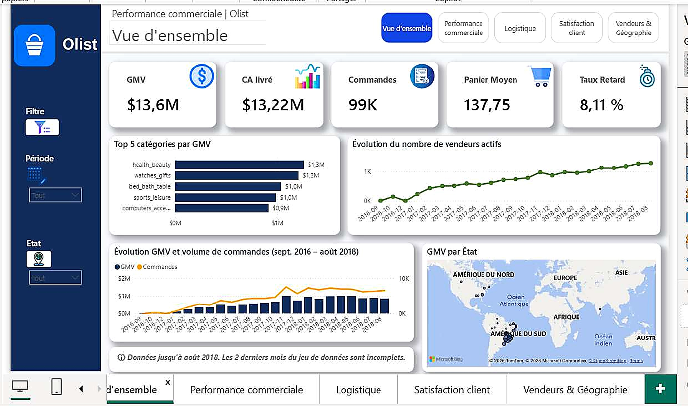
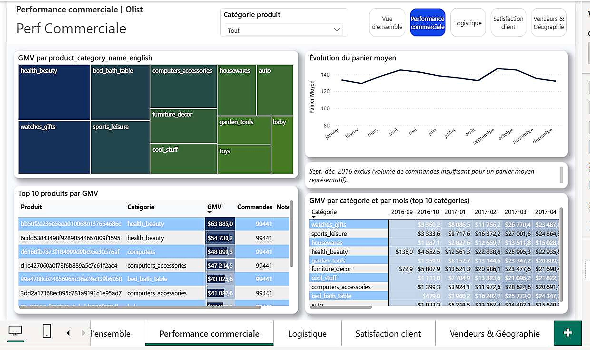
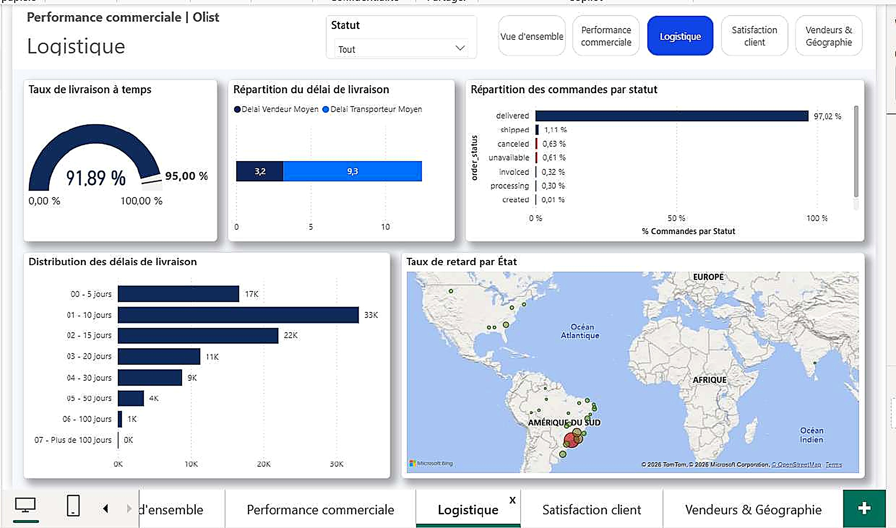
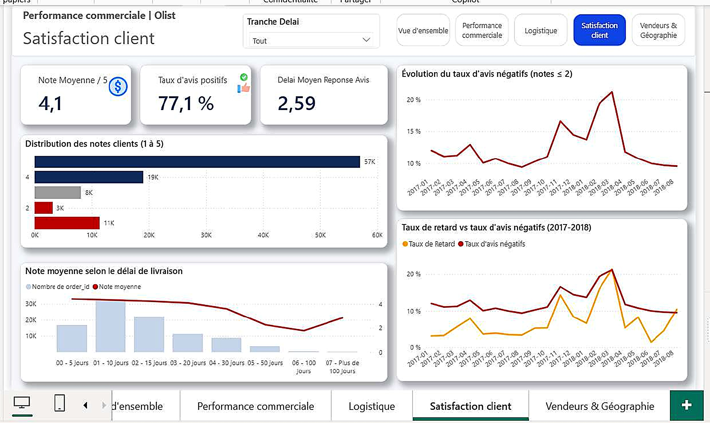

# 📊 Marketplace e-commerce Olist (Brésil) | Modèle en constellation, mesures DAX & dashboard décisionnel

## 📌 Overview

Projet Power BI complet mené de bout en bout sur le dataset Olist, une marketplace e-commerce multi-vendeurs brésilienne (99 441 commandes, 13,6 M R$ de GMV, 96 096 clients, 3 095 vendeurs, septembre 2016 à octobre 2018).

Le cœur du projet n'est pas uniquement le dashboard final, mais la rigueur de modélisation qui l'a précédé : un modèle en constellation conçu pour éviter les biais de sur-comptage, deux pièges de filtrage diagnostiqués et corrigés, dont un écart mesuré de 96 096 vs 9 145 sur une mesure de comptage client, et un insight central : la ponctualité de livraison domine largement les autres facteurs testés.

## 🎯 Business Problem

Avant de présenter des KPIs à un comité de direction, il faut s'assurer qu'ils sont exacts et pas seulement qu'ils s'affichent.

`order_items` est au grain produit, `payments` au grain paiement et `reviews` au grain avis. Les relier directement créerait un sur-comptage silencieux du chiffre d'affaires.

Ce projet documente la méthode retenue pour éviter ce problème ainsi que la démarche de vérification ayant permis d'identifier un cas réel où un filtre posé sur une dimension ne remontait pas vers les mesures censées en dépendre.

## ❓ Analytical Questions

* Quelle est l'évolution du chiffre d'affaires et du volume de commandes dans le temps ?
* Quels vendeurs et quelles catégories de produits génèrent le plus de valeur ?
* Les commandes sont-elles livrées dans les délais promis et où se situent les retards ?
* Quel est l'impact réel des retards de livraison sur la satisfaction client ?
* Comment le chiffre d'affaires et la clientèle se répartissent-ils géographiquement ?
* Quelle part des vendeurs concentre l'essentiel de l'activité et quel est le risque associé ?

## 📊 Dataset

* **Source :** Olist Brazilian E-Commerce
* **9 fichiers CSV sources** couvrant tout le cycle de vente : commande, produit, vendeur, client, paiement, avis et géolocalisation.
* **Logique relationnelle :** `orders` est le pivot du modèle. Une commande correspond à une ligne. `order_items`, `payments` et `reviews` s'y rattachent chacune à un grain différent.
* `geolocation`, avec 1 000 163 lignes, est retraitée puis fusionnée dans `customers` et `sellers` plutôt que conservée comme table indépendante.
* **Identification client à double niveau :** `customer_id` est une clé technique associée aux commandes, tandis que `customer_unique_id` identifie le client réel de manière stable.

## 🔎 Data Quality

| Anomalie / point vérifié                       | Détection                                                                | Traitement                                                         | Impact                                     |
| ---------------------------------------------- | ------------------------------------------------------------------------ | ------------------------------------------------------------------ | ------------------------------------------ |
| Concordance `payments` ↔ `order_items`         | Recoupement de `payment_value` avec `price + freight_value` par commande | 99,69 % de concordance à 1 centime près                            | Confirme la fiabilité globale des montants |
| Cohérence temporelle                           | Contrôle des dates du cycle de vie                                       | Aucune commande livrée avant son achat                             | Valide la cohérence temporelle             |
| Doublons sur clés primaires                    | Contrôle de `orders`, `products` et `sellers`                            | Aucun doublon strict                                               | Confirme l'intégrité référentielle         |
| 610 produits sans catégorie                    | Valeurs nulles dans `product_category_name`                              | Remplacement par `nao_informado`, traduit en `Unknown`             | Préserve les ventes dans les analyses      |
| 278 clients sans correspondance géographique   | Left Outer Join `customers` ↔ `geolocation_clean`                        | Clients conservés avec localisation inconnue                       | Évite une sous-estimation du CA            |
| 8 commandes `delivered` sans date de livraison | Contrôle statut / date                                                   | Création d'un flag `anomalie_livree_sans_date`                     | Rend l'anomalie traçable                   |
| 551 doublons d'avis                            | Plusieurs avis pour 547 commandes                                        | Conservation du plus récent                                        | Garantit une ligne par commande            |
| Géolocalisation avec 26 % de doublons          | Analyse du grain postal                                                  | Agrégation par code postal avec moyenne lat/lng et mode ville/État | 1 000 163 → environ 19 000 lignes          |

## 🧹 Data Preparation

L'ordre de traitement est dicté par les dépendances entre les tables.

`geolocation` est traitée en premier car elle sert de référence à `customers` et `sellers`. Viennent ensuite `products` et `category_translation`, puis `customers` et `sellers`, et enfin les tables transactionnelles `orders`, `order_items`, `payments` et `reviews`.

Une colonne `date_reference_ca_livre` est créée dans `orders` avec un repli en cascade :

1. Date de livraison client
2. Date de remise au transporteur
3. Date d'achat

Cette logique évite de perdre une commande dans les analyses temporelles.

`category_translation` est également complétée avec deux catégories absentes et un membre `Inconnu` afin de fiabiliser les jointures ultérieures.

## 🧱 Data Model

Le principe directeur est d'éviter le fan-out.

Une commande contenant trois articles et payée en deux fois donnerait six lignes si `order_items` et `payments` étaient directement reliées. Le chiffre d'affaires serait alors potentiellement sur-compté.

La règle appliquée est donc la suivante : les tables de faits ne sont jamais reliées directement entre elles. Elles se connectent uniquement à des dimensions communes.

Le modèle final repose ainsi sur un **schéma en constellation (Galaxy Schema)**.

### Piège 1 : relation 1:1 inattendue

`customer_id` est généré par commande et non par client réel. La relation entre `customers` et `orders` est donc 1:1.

Le sens de filtrage retenu est :

`customers → orders`

### Piège 2 : chemin ambigu

Conserver `geolocation_clean` et `category_translation` comme tables chargées en plus de leurs données fusionnées dans `customers`, `sellers` et `products` créerait plusieurs chemins de propagation vers les mêmes tables.

La solution retenue consiste à utiliser ces requêtes uniquement comme étapes intermédiaires Power Query avec chargement désactivé dans le modèle final.

## 📐 Analytical Approach

### Comptage des commandes

`DISTINCTCOUNT(order_items[order_id])` sous-compte de 775 commandes car les statuts `unavailable` et `canceled` ne possèdent aucune ligne dans `order_items`.

La mesure correcte repose donc sur :

`COUNTROWS(orders)`

La table pivot `orders` est utilisée pour compter les commandes.

### CA reconnu

Deux notions sont distinguées :

* CA généré
* CA réellement livré

Une mesure `CA livré` dédiée est filtrée sur les commandes `delivered` et utilise une relation inactive avec le calendrier via `USERELATIONSHIP`.

### Propagation des filtres

Une mesure de nombre de clients affichait 96 096 au lieu de 9 145 lorsqu'elle était filtrée par catégorie `cama_mesa_banho`.

La cause était le sens unique des relations.

La solution retenue est l'utilisation ciblée de `CROSSFILTER` dans la mesure concernée plutôt qu'une relation bidirectionnelle permanente, afin d'éviter de créer de nouvelles ambiguïtés dans le modèle.

### Note moyenne par vendeur

`reviews` étant reliée aux commandes et non directement aux vendeurs, le filtre vendeur doit traverser `order_items` puis `orders`.

`CROSSFILTER` est donc utilisé localement dans la mesure.

### `RELATED()` comme alternative

Pour le calcul du délai moyen d'expédition par vendeur, `RELATED()` est utilisé comme alternative à `CROSSFILTER`.

La distinction retenue est la suivante :

* `CROSSFILTER` agit sur la propagation des filtres.
* `RELATED()` effectue un lookup ligne par ligne.

## 📊 Dashboard

Le rapport comprend cinq pages décisionnelles.

### Page 1 — Vue d'ensemble

**Objectif :** synthèse pilotable de l'activité globale.

**KPI :**

* GMV : 13,6 M$
* CA livré : 13,22 M$
* Commandes : 99K
* Panier moyen : 137,75
* Taux de retard : 8,11 %

**Analyses :**

* Top 5 catégories par GMV
* Évolution du nombre de vendeurs actifs
* Évolution du GMV et du volume de commandes
* GMV par État

Une note de fiabilité signale que les deux derniers mois du dataset sont incomplets.



### Page 2 — Performance commerciale

**Objectif :** analyser la performance par produit et catégorie.

**Analyses :**

* GMV par catégorie
* Évolution du panier moyen
* Top 10 produits par GMV
* GMV par catégorie et par mois

Les mois de septembre à décembre 2016 sont exclus de l'analyse du panier moyen en raison d'un volume de commandes insuffisant.



### Page 3 — Logistique

**Objectif :** piloter la performance de livraison.

**KPI :**

* Taux de livraison à temps : 91,89 %
* Objectif : 95,00 %
* Délai vendeur moyen : 3,2 jours
* Délai transporteur moyen : 9,3 jours

**Analyses :**

* Répartition des commandes par statut
* Distribution des délais de livraison
* Taux de retard par État



### Page 4 — Satisfaction client

**Objectif :** relier qualité de service et satisfaction.

**KPI :**

* Note moyenne : 4,1/5
* Taux d'avis positifs : 77,1 %
* Délai moyen de réponse : 2,59 jours

**Analyses :**

* Distribution des notes
* Évolution du taux d'avis négatifs
* Note moyenne selon le délai de livraison
* Taux de retard vs taux d'avis négatifs

L'insight central du projet est la relation entre retard de livraison et satisfaction client.



### Page 5 — Vendeurs & Géographie

**Objectif :** identifier la concentration de valeur et de risque.

**Analyses :**

* Top 12 vendeurs par GMV
* Bottom 12 vendeurs par GMV
* GMV par État
* Nombre de clients par État
* Pareto de concentration du GMV

La carte logistique utilise la couleur pour représenter le taux de retard, tandis que la carte vendeurs utilise la taille des bulles pour représenter le GMV.


## 🔑 Key Insights

* **Retard et satisfaction :** la note moyenne passe de 4,29/5 à 2,27/5 lorsqu'une commande est livrée en retard. La ponctualité apparaît comme le principal levier de satisfaction parmi les facteurs étudiés.

* **Concentration vendeurs :** 10 % des vendeurs, soit 309 sur 3 095, génèrent 67,5 % du GMV. Cette concentration représente à la fois un risque de dépendance et une opportunité de priorisation des comptes stratégiques.

* **Black Friday :** un pic de commandes de 63 % apparaît en novembre 2017 par rapport à octobre. Ce phénomène est cohérent avec l'activité commerciale du Black Friday et ne constitue pas une anomalie de données.

* **Diversification du catalogue :** aucune catégorie ne représente plus de 10 % du GMV total, ce qui indique une forte diversification du portefeuille produit.

* **Concentration géographique :** São Paulo, Rio de Janeiro et Minas Gerais représentent ensemble 63,4 % du GMV. Les autres États constituent donc un potentiel de développement commercial.

## 💡 Business Recommendations

1. Améliorer en priorité la performance logistique afin de réduire le taux de retard et son impact sur la satisfaction.

2. Fidéliser les 309 vendeurs stratégiques représentant environ deux tiers du GMV.

3. Développer les marchés situés en dehors du Sud-Est brésilien.

4. Maintenir la diversité du catalogue produit.

5. Optimiser l'expérience de paiement, notamment autour du boleto qui représente environ 19 % des transactions.

## 🛠️ Technologies

**Power BI Desktop · Power Query (M) · DAX · Modélisation en constellation**

Fonctions DAX principales :

`DIVIDE` · `CROSSFILTER` · `USERELATIONSHIP` · `AVERAGEX` · `DATEDIFF`

Autres techniques :

* Formule de Haversine pour le calcul des distances acheteur-vendeur
* Modélisation en constellation
* Gestion des relations à sens unique
* Relations actives et inactives
* Préparation avancée des données avec Power Query

## 📁 Project Structure

```text
analyse-performance-olist/
├── README.md
├── screenshots/
│   ├── 01_Performance_commerciale.jpg
│   ├── 02_Vue_ensemble.jpg
│   ├── 03_Logistique.jpg
│   ├── 04_Satisfaction_client.jpg
│   └── 05_Vendeurs_Geographie.jpg
├── documentation/
│   └── Documentation_Projet_PowerBI_Olist.docx
├── data/
└── pbix/
    └── analyse-performance-olist.pbix
```

## ▶️ How to Explore

Le dashboard est présenté à travers les cinq captures disponibles dans le dossier `screenshots`.

Le fichier `.pbix` peut être ajouté dans le dossier `pbix/` afin de permettre l'exploration interactive du modèle, des relations, des mesures DAX et des différentes pages du rapport.

## ⚠️ Limitations

* Aucun identifiant de transporteur n'est disponible dans le dataset. La comparaison entre transporteurs n'est donc pas possible.
* La géolocalisation est approximative car elle repose sur une moyenne par code postal.
* Le dataset s'arrête en octobre 2018 et constitue un historique figé.
* La relation entre retard et satisfaction est forte mais ne constitue pas, à elle seule, une preuve de causalité.
* Les deux derniers mois du dataset sont incomplets et doivent être interprétés avec prudence.

## 🚧 Vérifications avant mise en production

* Tester les six relations une par une avec des segments et des visuels simples.
* Vérifier que `Nombre de clients` réagit correctement aux filtres produits et vendeurs.
* Vérifier que `Note moyenne par vendeur` réagit correctement aux filtres vendeurs.
* Contrôler les valeurs numériques de `customer_lat` et `customer_lng` après toute modification du modèle.

## 🚀 Future Improvements

* Analyse de sentiment des commentaires clients.
* Segmentation RFM des clients.
* Analyse de cohortes.
* Prévision du GMV mensuel.
* Simulation What-If de réduction du taux de retard.
* Analyse plus avancée de la relation entre satisfaction, logistique et valeur de commande.

## 🎓 Skills Demonstrated

| Compétence        | Preuve                                                                                                                    |
| ----------------- | ------------------------------------------------------------------------------------------------------------------------- |
| Data Quality      | Audit systématique des 9 tables sources, concordance financière à 99,69 %, gestion des données manquantes et anomalies    |
| DAX avancé        | `CROSSFILTER`, `USERELATIONSHIP`, `DIVIDE`, `AVERAGEX`, `DATEDIFF` et diagnostic des problèmes de propagation des filtres |
| Power Query       | Agrégation de plus d'un million de lignes de géolocalisation et dédoublonnage déterministe des avis                       |
| Data Modeling     | Conception d'un schéma en constellation pour éviter le fan-out entre tables à grains différents                           |
| Business Analysis | Identification de la ponctualité comme principal levier de satisfaction parmi les facteurs étudiés                        |
| Problem Solving   | Séparation du délai vendeur et du délai transporteur pour distinguer correctement les responsabilités                     |
