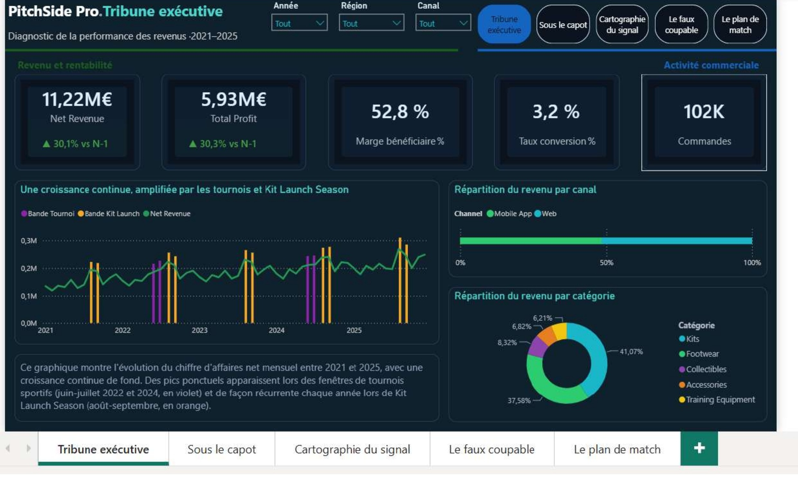
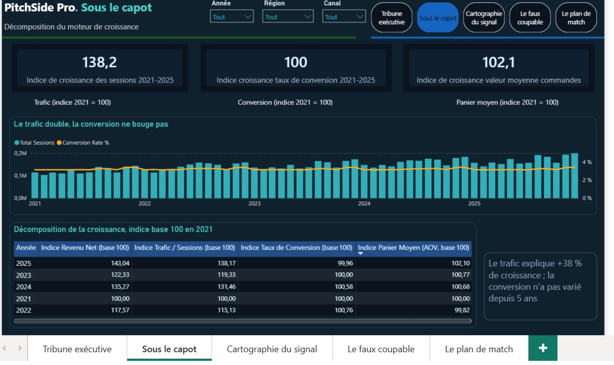
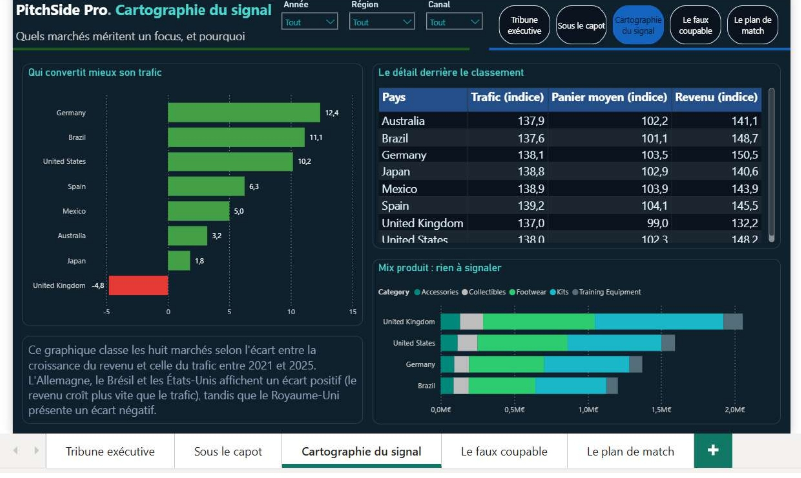
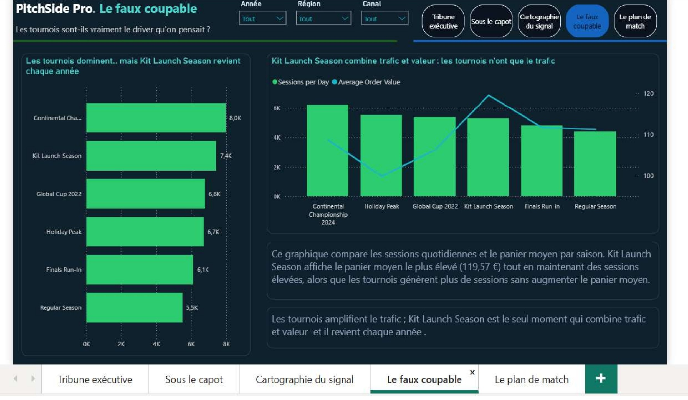

# ⚽ PitchSide Pro — Diagnostic de la Performance des Revenus

## 📌 Overview

Projet Power BI réalisé dans le cadre de la Manche 1 du **Power BI Data Visualization World Championship 2026**, sur le jeu de données fictif PitchSide Pro, un e-commerce mondial d'articles de football sur la période 2021-2025.

La démarche repose sur un principe directeur : **« Laisser les chiffres trancher d'abord »**. Chaque hypothèse a été formulée, testée puis confirmée ou rejetée avant de construire la thèse finale et les recommandations.

## 🎯 Business Problem

Décomposer une croissance de revenu de **+43 % sur 5 ans** selon ses principaux moteurs : trafic, conversion et panier moyen.

L'objectif est d'éviter d'attribuer cette croissance à une intuition séduisante, notamment l'impact des grands tournois sportifs, et d'orienter les décisions d'investissement sur des facteurs réellement vérifiés.

## ❓ Analytical Questions

* Quelle part de la croissance du revenu vient du trafic, de la conversion ou du panier moyen ?
* Les pics liés aux événements sportifs créent-ils un effet durable ou seulement des opportunités ponctuelles ?
* Quelle région mérite le prochain investissement marketing ?
* Le mix produit ou la pression promotionnelle expliquent-ils les écarts entre marchés ?
* Le canal Mobile App convertit-il différemment du Web ?

## 📊 Dataset

* **Source** : jeu de données fourni dans le cadre du Power BI Data Visualization World Championship 2026.
* **Période** : 2021-2025.
* **Couverture** : 8 pays, 3 macro-régions et 2 canaux.
* **Tables** :

  * `FactSales` : 133 362 lignes, grain ligne de commande.
  * `FactTraffic` : 29 216 lignes, grain jour × région × canal.
  * `DimDate` : 1 826 jours.
  * `DimProduct` : 100 produits.
  * `DimCustomer` : 30 000 clients.
  * `DimRegion` : 8 pays.
  * `DimChannel` : 2 canaux.

## 🔎 Data Quality

| Vérification                    | Résultat                | Implication                       |
| ------------------------------- | ----------------------- | --------------------------------- |
| Intégrité référentielle         | 0 orphelin              | Modèle fiable                     |
| Doublons Date × Région × Canal  | Aucun                   | Pas de risque de double comptage  |
| Granularité `FactTraffic`       | 29 216 lignes attendues | Table dense et complète           |
| `PromoType` NULL                | 53 % des lignes         | Correspond à `DiscountAmount = 0` |
| Gross / Discount / Net / Profit | Écarts ≤ 0,02 €         | Écarts liés à l'arrondi           |
| Valeurs aberrantes              | Aucune détectée         | Pas de traitement supplémentaire  |

Le seul nettoyage retenu consiste à recoder les valeurs NULL de `PromoType` en **« Prix Plein »** via Power Query.

La donnée source n'a pas été modifiée, conformément aux règles du concours.

## 🧹 Data Preparation

Le traitement Power Query reste volontairement minimal.

Le recodage de `PromoType` est effectué au chargement afin de conserver une séparation claire entre :

* la préparation des données dans Power Query ;
* les calculs métier dans DAX ;
* les données sources originales.

## 🧱 Data Model

Le modèle repose sur un **schéma en étoile avec deux tables de faits à grains différents**.

`FactSales` et `FactTraffic` ne sont jamais reliées directement. Elles communiquent uniquement à travers les dimensions communes :

* `DimDate`
* `DimRegion`
* `DimChannel`

`DimProduct` et `DimCustomer` sont uniquement reliées à `FactSales`, car `FactTraffic` est déjà agrégée au niveau jour × région × canal.

### Point de vigilance

`DimCustomer` contient une colonne `MacroRegion` qui duplique une information présente dans `DimRegion`.

Cette dénormalisation provient des données sources et n'a pas été modifiée.

Le modèle privilégie donc un seul chemin de filtrage par visuel afin d'éviter toute ambiguïté.

`DimDate` est également configurée explicitement comme table de dates afin de garantir le fonctionnement des fonctions DAX de Time Intelligence.

## 📐 Analytical Approach

### Axe temporel : croissance continue de +43 %

L'effet tournoi brut indiquait initialement une hausse de **+19 % du revenu par jour** pendant les fenêtres événementielles.

Cette lecture pouvait toutefois être trompeuse puisque la tendance de fond progressait déjà d'environ **9,5 % par an**.

La comparaison a donc été corrigée en confrontant chaque fenêtre événementielle à la même fenêtre calendaire des autres années.

Cette approche permet de distinguer l'effet événementiel de la croissance organique.

### Axe Facteurs : Sessions × Conversion × AOV

| Indicateur         | 2021 |  2025 |
| ------------------ | ---: | ----: |
| Sessions           |  100 | 138,2 |
| Taux de conversion |  100 | 100,0 |
| Panier moyen       |  100 | 102,1 |

**Verdict :** le trafic, en hausse de **38,2 %**, explique presque intégralement la croissance du revenu de **43 %**.

Le taux de conversion reste pratiquement stable, entre **2,99 % et 3,01 %**.

### Vérification par région et par canal

L'analyse a été contrôlée sur deux axes indépendants :

* les 8 pays présentent des variations de conversion comprises entre +0,9 % et -0,5 % ;
* Web et Mobile App présentent une évolution du trafic identique à la décimale près ;
* aucune rupture structurelle de conversion n'a été observée.

### Axe Mix

Deux hypothèses ont été testées puis rejetées :

| Hypothèse                                                                              | Résultat    |
| -------------------------------------------------------------------------------------- | ----------- |
| Le mix produit explique la sur-performance de l'Allemagne, des États-Unis et du Brésil | **Rejetée** |
| La pression promotionnelle explique la sous-performance du Royaume-Uni                 | **Rejetée** |

Les écarts de mix produit restent inférieurs à 2 % et les taux de remise du Royaume-Uni restent proches de la moyenne.

Deux pistes restent ouvertes pour une analyse ultérieure : le mix fin `StarPlayer` / `BrandLine` et les effets macroéconomiques liés à `PriceIndex` / `ConversionIndex`.

## 📊 Dashboard

Le rapport comprend **5 pages**.

### Page 1 : Tribune exécutive

**Objectif :** comprendre rapidement l'état global de l'activité.

**KPI :**

* Net Revenue : 11,22 M€
* Total Profit : 5,93 M€
* Marge bénéficiaire : 52,8 %
* Taux de conversion : 3,2 %
* Commandes : 102 K

**Analyses :**

* évolution du revenu net mensuel 2021-2025 ;
* fenêtres de tournois et Kit Launch Season ;
* revenu par canal ;
* revenu par catégorie.



### Page 2 : Sous le capot

**Objectif :** comprendre pourquoi le revenu progresse.

**Indicateurs :**

* croissance des sessions : 138,2 ;
* croissance du taux de conversion : 100 ;
* croissance du panier moyen : 102,1.

Le visuel central combine les Sessions et le Conversion Rate avec une échelle Y volontairement fixée à 0-5 % afin de ne pas amplifier artificiellement une variation faible.

**Insight principal :** le trafic progresse tandis que la conversion reste stable.



### Page 3 : Cartographie du signal

**Objectif :** identifier les marchés nécessitant une analyse approfondie.

Le classement utilise la mesure `Revenue vs Traffic Gap 2021-2025`.

Les principaux écarts positifs sont :

* Allemagne : +12,4 points ;
* Brésil : +11,1 points ;
* États-Unis : +10,2 points.

Le Royaume-Uni présente le seul écart négatif significatif avec **-4,8 points**.



### Page 4 : Le faux coupable

**Objectif :** déterminer si les tournois sportifs constituent réellement le principal moteur de croissance.

L'analyse compare :

* revenu par jour ;
* sessions par jour ;
* panier moyen ;
* différentes périodes saisonnières.

La **Kit Launch Season** atteint 7 427 €/jour avec un AOV de 119,57 € et revient chaque année.

Les tournois génèrent principalement un effet de volume et restent ponctuels.



### Page 5 : Le plan de match

**Objectif :** transformer les résultats analytiques en décisions.

Trois axes sont proposés :

1. Optimiser la conversion.
2. Recalibrer le calendrier autour de Kit Launch Season.
3. Investiguer les marchés présentant une sur-performance d'AOV.

Cette page synthétise les conclusions des pages précédentes sans introduire de nouvelle analyse brute.


## 🔑 Key Insights

* Le trafic a progressé de **38,2 %** sur cinq ans alors que le taux de conversion est resté proche de 3 %. La croissance repose donc principalement sur l'acquisition.
* L'effet tournoi brut de +19 % du revenu par jour diminue après correction de la tendance organique et comparaison avec des fenêtres calendaires équivalentes.
* L'Allemagne, les États-Unis et le Brésil présentent une progression de l'AOV supérieure à celle du trafic, sans différence significative de mix produit ou de pression promotionnelle.
* La cause exacte de cette progression de l'AOV n'est pas démontrée. Elle doit donc être considérée comme une piste d'investigation et non comme une conclusion causale.

## 💡 Business Recommendations

### 1. Prioriser la conversion

Avant d'augmenter davantage les investissements d'acquisition, optimiser l'entonnoir de conversion.

Un gain de **+0,3 à +0,5 point** de conversion à trafic constant pourrait générer une progression importante du revenu.

### 2. Investiguer trois marchés prioritaires

L'Allemagne, les États-Unis et le Brésil doivent être considérés comme des marchés prioritaires à étudier.

L'objectif immédiat n'est pas de lancer une stratégie commerciale, mais d'identifier la cause de leur progression d'AOV.

### 3. Recalibrer le calendrier marketing

La **Kit Launch Season**, récurrente chaque année, mérite une attention particulière pour :

* la planification marketing ;
* la gestion des stocks ;
* les campagnes d'acquisition ;
* la préparation commerciale.

Les tournois sportifs doivent être considérés comme des accélérateurs ponctuels plutôt que comme le moteur structurel de la croissance.

## 🛠️ Technologies

* Power BI Desktop
* Power Query (M)
* DAX
* Modélisation en étoile
* Time Intelligence
* Analyse de croissance
* Data Storytelling

Principales fonctions DAX utilisées :

`DIVIDE` · `DISTINCTCOUNT` · `CALCULATE` · `SAMEPERIODLASTYEAR` · `TOTALYTD`

## 📁 Project Structure

```text
analyse-pitchside-pro-revenue/
├── README.md
├── screenshots/
│   ├── 01-tribune-executive.jpg
│   ├── 02-sous-le-capot.jpg
│   ├── 03-cartographie-du-signal.jpg
│   ├── 04-le-faux-coupable.jpg
│   └── 05-le-plan-de-match.jpg
├── documentation/
│   └── PitchSidePro_Documentation_Projet.docx
├── data/
└── pbix/
```

## ▶️ How to Explore

Le dossier `screenshots/` permet de consulter les cinq pages du dashboard.

La documentation présente la démarche complète du projet, depuis le cadrage métier jusqu'aux mesures DAX et à l'évaluation des hypothèses.

Le fichier `.pbix` peut être ajouté dans le dossier `pbix/` après vérification de sa taille et de son intérêt pour une publication GitHub.

## ⚠️ Limitations

* Dataset fictif fourni dans le cadre du concours.
* Aucune donnée externe ajoutée conformément au règlement.
* `FactTraffic` est agrégée au niveau jour × région × canal et ne permet donc pas de croiser les métriques de trafic avec des attributs individuels de client ou de produit.
* La cause exacte de la progression de l'AOV en Allemagne, aux États-Unis et au Brésil n'a pas été isolée.
* L'érosion de l'AOV au Royaume-Uni n'est expliquée ni par le mix produit ni par la pression promotionnelle.

## 🚀 Future Improvements

* Identifier la cause de la progression de l'AOV en Allemagne, aux États-Unis et au Brésil.
* Étudier le mix `StarPlayer` / `BrandLine`.
* Tester l'influence de `PriceIndex` et `ConversionIndex`.
* Analyser les cohortes de clients acquis pendant les fenêtres de tournoi.
* Croiser `Price Tier` et `Country`.
* Investiguer séparément l'érosion de l'AOV au Royaume-Uni.

## 🎓 Skills Demonstrated

| Compétence        | Preuve                                                                                                                    |
| ----------------- | ------------------------------------------------------------------------------------------------------------------------- |
| Data Quality      | Vérifications systématiques de l'intégrité référentielle, des doublons, de la granularité et de la cohérence arithmétique |
| DAX               | Décomposition Sessions × Conversion × AOV, mesures à bornes fixes et `DISTINCTCOUNT`                                      |
| Data Modeling     | Schéma en étoile avec deux tables de faits à grains différents                                                            |
| Power Query       | Nettoyage minimal et justifié avec recodage de `PromoType`                                                                |
| Business Analysis | Hypothèses testées puis explicitement rejetées avant formulation de la thèse                                              |
| Data Storytelling | Construction d'un parcours exécutif allant du constat aux recommandations                                                 |
| Problem Solving   | Distinction entre corrélation observée et causalité démontrée                                                             |
