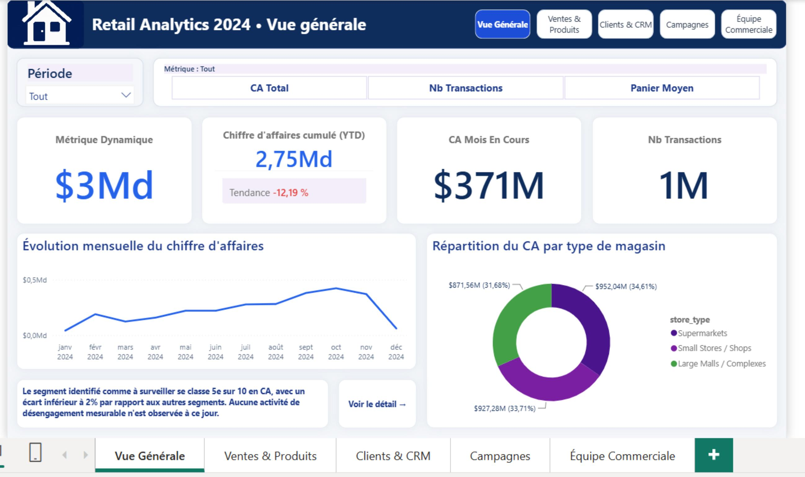
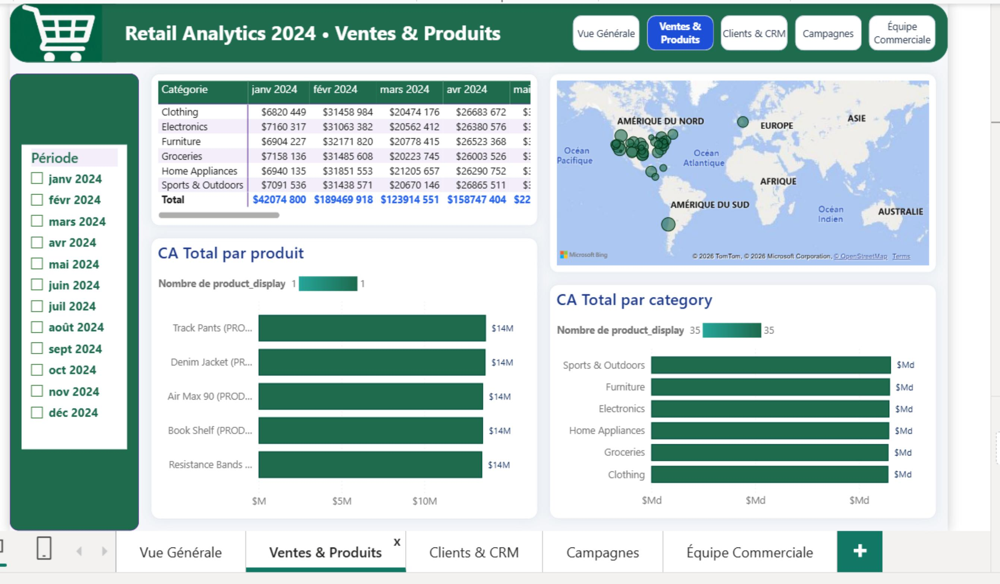
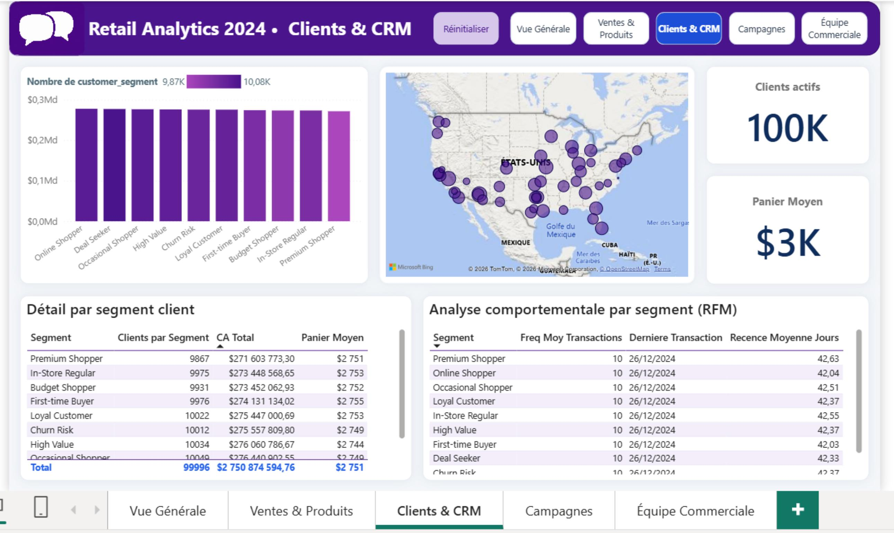
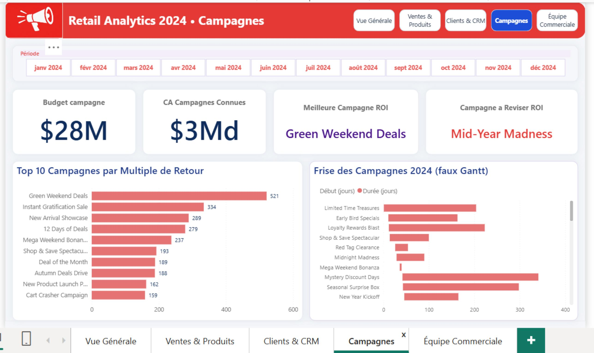
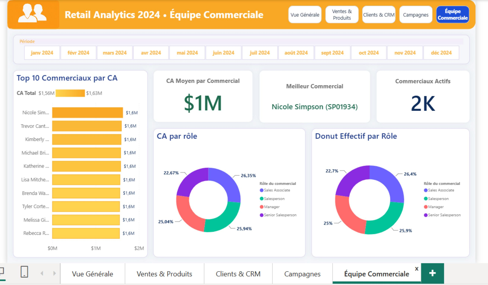

# Retail Analytics 2024 — Star Schema, Audit DAX & Dashboard Power BI

## 📌 Overview

Projet Power BI complet sur un an de ventes retail (1 000 000 transactions, 2,75 Md€ de CA, 100 000 clients, 500 magasins, 2 000 commerciaux, 50 campagnes marketing). Le cœur du projet n'est pas le dashboard final mais la **démarche d'audit qui l'a précédé** : 6 bugs DAX réels diagnostiqués par recoupement systématique entre exports du dashboard et recalcul indépendant sur les données sources, une hypothèse métier testée et invalidée (le segment client "Churn Risk"), et une découverte analytique qui vient nuancer une conclusion établie plus tôt dans le projet.

## 🎯 Business Problem

Avant de présenter des chiffres à un comité de direction, s'assurer qu'ils sont exacts — pas seulement qu'ils s'affichent. Ce projet documente la méthode : chaque mesure DAX suspecte a été recoupée avec un recalcul indépendant sur les données sources avant validation, et chaque conclusion "intuitive" (segment à risque, écart de performance entre rôles) a été vérifiée statistiquement avant d'être présentée comme un fait.

## ❓ Analytical Questions

- Les chiffres affichés dans le dashboard sont-ils fiables (recoupement indépendant possible) ?
- Le segment client "Churn Risk" reflète-t-il un vrai comportement d'achat, ou est-ce une étiquette arbitraire ?
- L'écart de chiffre d'affaires observé entre rôles commerciaux traduit-il une différence de performance individuelle ?
- Où se situe la vraie variance actionnable dans ce dataset (campagnes ? catégories ? segments ?) ?
- Quelle est la dynamique temporelle réelle du CA sur l'année ?

## 📊 Dataset

- **Source** : `[INFORMATION À CONFIRMER]`
- **Modèle en étoile** : 1 table de faits (`fact_sales`) + 6 dimensions.
- **Volumétrie réelle dans Power BI** : `fact_sales` = 1 000 000 lignes, `dim_customers` = 100 000 clients (10 segments), `dim_products` = 210 produits (6 catégories), `dim_stores` = 500 magasins (3 types), `dim_salespersons` = 2 000 commerciaux (4 rôles), `dim_campaigns` = 50 campagnes, `dim_dates` = 366 jours (année 2024 uniquement, pas de 2023/2025).
- **Point de vigilance documenté** : les fichiers CSV fournis pour vérification hors Power BI ne contiennent que 400 000 lignes (échantillon à 40 %, ratio exact de 2,5 confirmé sur plusieurs métriques) — pas le volume réel du modèle. Point de méthode explicitement consigné pour ne pas le reproduire.

## 🔎 Data Quality

| Anomalie | Détection | Traitement | Impact |
|---|---|---|---|
| Homonymie commerciaux (`salesperson_name`) | 21 noms sur 2 000 correspondent à des personnes différentes (ex. 2 "William Clark" distincts) | Regroupement sur la clé unique `salesperson_sk` ; colonne d'affichage `salesperson_display = nom (ID)` créée en Power Query | Sans correction, "Meilleur Commercial" désignait un artefact de fusion (3 "Michael Davis" cumulés à 1,62M€) et non le vrai n°1 (Nicole Simpson, 737 804€) |
| Homonymie produits (`product_name`) | "Running Shoes" regroupait 4 produits distincts (3 marques, 2 catégories) | Colonne `product_display = nom (ID)` ; `brand` seul insuffisant (2 "Running Shoes" de marque Puma existent) | Le Top 10 Produits affichait un faux n°1 cumulant 20,9M€ contre 5,6M€ pour le vrai n°1 |
| `store_name` non unique | 500 magasins pour 50 noms distincts (~10 occurrences chacun) | Vérifié : structure de franchise légitime, pas une anomalie. Colonne `store_display` créée en prévention | Aucun impact sur les visuels actuels (la carte utilise `store_location`) |
| Espace parasite sur `store_type` | "Supermarkets " avec espace final détecté en comparant les valeurs distinctes du CSV brut | `Text.Trim()` en Power Query | Sans correction, le donut de répartition affichait 4 segments au lieu de 3 |
| Échantillon CSV à 40 % du volume réel | Écart entre volumétrie annoncée (1M) et CSV fournis (400K) | Vérifié par `COUNTROWS` et recoupement sur plusieurs métriques (ratio exact 2,5) | Aucune duplication réelle — erreur de comparaison identifiée et documentée comme piège méthodologique |
| Segment "Churn Risk" non comportemental | Test RFM direct : fréquence d'achat (écart 0,7 %) et récence individuelle moyenne (écart 1,4 %) quasi identiques aux 9 autres segments | Aucune correction de donnée — conclusion documentée et communiquée comme limite | Empêche une action de rétention marketing basée à tort sur ce label |

## 🧹 Data Preparation

Colonnes d'affichage désambiguïsées créées en **Power Query** pour chaque dimension à risque d'homonymie (`product_display`, `salesperson_display`, `store_display`, au format `nom (ID)`), nettoyage de `store_type` (`Text.Trim`), et colonnes calculées dédiées à la frise chronologique des campagnes (`Date Début Campagne` via `LOOKUPVALUE`, `Jours Depuis Debut Annee` via `DATEDIFF`) — choisies comme colonnes plutôt que mesures car elles ne dépendent d'aucun contexte de filtre.

## 🧱 Data Model

Schéma en étoile classique : `fact_sales` reliée à 6 dimensions. Un point de modélisation notable : **`dim_campaigns` référence `dim_dates` deux fois** (`start_date_sk`, `end_date_sk`), ce qui viole la règle Power BI d'une seule relation active entre deux tables. Décision retenue : aucune relation active entre les deux tables, résolution de la date de début via `LOOKUPVALUE` en colonne calculée. Conséquence assumée et documentée : le slicer Période ne filtre pas les visuels construits uniquement sur `dim_campaigns` (ex. la frise des campagnes) — comportement volontaire et cohérent avec le métier (un calendrier de campagne ne doit pas changer selon un filtre de période appliqué ailleurs).

## 📐 Analytical Approach — 6 bugs DAX diagnostiqués et corrigés

| Bug | Symptôme | Cause racine | Correctif |
|---|---|---|---|
| `CA Campagnes Connues` | La mesure renvoyait le grand total (2,75 Md€) pour les 50 campagnes au lieu d'un CA distinct | Un filtre `CALCULATE` sur une colonne **remplace** le contexte de filtre existant au lieu de s'y ajouter | Ajout de `KEEPFILTERS()` pour forcer l'intersection |
| `Meilleur Commercial` / `CA par Commercial` | Un "meilleur vendeur" qui n'existait pas individuellement (artefact de fusion d'homonymes) | Regroupement sur `salesperson_name` (non unique) au lieu de `salesperson_sk` | Regroupement sur la clé technique, résolution du libellé uniquement à l'affichage (`LOOKUPVALUE`) |
| `ROI Campagne %` | 957 765,98 % affiché au niveau agrégé | Le DAX multipliait déjà par 100, et le format natif "Pourcentage" multipliait une seconde fois | Suppression du `*100` dans le DAX, garde-fou `HASONEVALUE` pour bloquer l'affichage au niveau agrégé |
| `Croissance QoQ %` | 3 mois d'un même trimestre affichaient 3 valeurs différentes | Asymétrie de granularité : le CA courant restait au grain du visuel (1 mois) contre 3 mois pour la période de référence | Nouvelle mesure `CA Trimestre Courant` forçant l'élargissement explicite au trimestre entier |
| `Croissance MoM %` | -83,68 % en décembre, lisible à tort comme un effondrement d'activité | Comparaison sur un mois incomplet (26 jours sur 31) | Garde-fou explicite bloquant l'affichage sur les mois non comparables (janv./fév./déc.) |
| `Métrique Dynamique` | La carte affichait littéralement le texte `"€ #,##0.00"` au lieu d'un montant | Confusion entre le corps de la mesure (calcul) et la propriété de formatage dynamique `fx` (présentation) | Séparation stricte des deux objets |

**Point de vigilance méthodologique documenté dans le projet lui-même** : une extrapolation erronée a d'abord fait croire que le bug de double comptage du ROI touchait aussi les valeurs par campagne individuelle — vérification manuelle refaite, ce n'était pas le cas. Cette autocorrection en cours de session est conservée dans la documentation comme preuve de rigueur de vérification, pas comme faiblesse.

### Investigation RFM — hypothèse testée et invalidée

Le segment client "Churn Risk" aurait pu légitimement inquiéter une direction marketing. Trois niveaux de vérification croissants ont été appliqués : fréquence moyenne de transactions par segment (écart de 0,7 %, le plus faible mesuré sur tout le projet), puis récence moyenne calculée **par client individuel** (méthode robuste, non biaisée par la taille du groupe) plutôt que par `MAX` du segment (biaisé). Résultat : Churn Risk (42,37 jours) est statistiquement indiscernable de High Value et Loyal Customer. Conclusion établie par test, pas par déduction : le label ne reflète aucune différence de comportement d'achat mesurable.

### Découverte tardive — l'écart de CA par rôle commercial est un effet d'effectif

La construction d'un donut "Effectif par Rôle" (Page 5) a permis de trancher une question restée ouverte plus tôt dans l'audit : l'écart de CA entre rôles (~16,3 %) suit exactement le même classement et la même amplitude que l'écart d'effectif entre rôles (~16,3 %). Conclusion : ce n'est pas une différence de performance individuelle, c'est un pur effet de volume — plus un rôle compte de commerciaux, plus son CA cumulé est élevé proportionnellement. Cette découverte est venue **nuancer et corriger** une conclusion précédente du projet (section storytelling mise à jour en conséquence).

## 📊 Dashboard

### Page 1 — Vue Générale
**Objectif :** synthèse globale pilotable.
**KPI :** Métrique Dynamique (pilotée par un slicer déconnecté), CA cumulé YTD (2,75 Md€), CA Mois En Cours (371M€, ancré sur le dernier mois complet plutôt que le dernier mois disponible) avec tendance (-12,19 %), Nb Transactions.
**Analyses :** évolution mensuelle du CA (courbe), répartition du CA par type de magasin (donut, 3 segments après nettoyage `Text.Trim`).
**Insights :** zone de texte au ton neutre sur le "Segment à Surveiller" — délibérément non alarmiste, car le CA de ce segment est comparable aux 9 autres (5e/10, écart < 2 %).



### Page 2 — Ventes & Produits
**Objectif :** analyser la performance par catégorie et produit.
**KPI :** intégrés au tableau catégorie × mois.
**Analyses :** matrice Catégorie × Mois (mise en forme conditionnelle, révèle la saisonnalité), Top 10 Produits par CA (sur `product_display`, jamais `product_name` seul), carte géographique des ventes.
**Insights :** l'évolution du Top 5 Produits dans le temps montre des courbes quasiment superposées toute l'année — 7ᵉ confirmation indépendante d'un motif d'uniformité observé sur tout le dataset.



### Page 3 — Clients & CRM
**Objectif :** comprendre la base client par segment.
**KPI :** Clients actifs (100K), Panier Moyen (3K$).
**Analyses :** CA par segment client (barres), carte géographique clients, table détail par segment, table Fréquence/Récence par segment (RFM).
**Insights :** la table RFM est la preuve directe de l'invalidation du segment "Churn Risk" (fréquence et récence quasi identiques aux autres segments).



### Page 4 — Campagnes
**Objectif :** évaluer le retour sur investissement marketing.
**KPI :** Budget campagne (28M$), CA Campagnes Connues (3Md$), Meilleure Campagne ROI (Green Weekend Deals), Campagne à Réviser ROI (Mid-Year Madness).
**Analyses :** Top 10 Campagnes par Multiple de Retour (plutôt que par ROI % brut, pour la lisibilité), Frise des Campagnes 2024 construite en "faux Gantt" (barres empilées standard, jamais 100 %, avec un segment invisible pour positionner le début).
**Insights :** le ROI par campagne varie de 54,78 % à 520,28 % (facteur ×9,5) — c'est la seule vraie source de variance actionnable identifiée sur l'ensemble du dataset, et elle est pilotée par la taille du budget engagé, pas par la performance intrinsèque de la campagne.



### Page 5 — Équipe Commerciale
**Objectif :** analyser la performance commerciale par individu et par rôle.
**KPI :** Meilleur Commercial (Nicole Simpson, SP01934), CA Moyen par Commercial (1M$), Commerciaux actifs (2K).
**Analyses :** Top 10 Commerciaux par CA (sur `salesperson_display`), donut CA par Rôle, donut Effectif par Rôle (ajouté spécifiquement pour trancher la question de la section précédente).
**Insights :** la comparaison des deux donuts démontre que l'écart de CA par rôle (~16 %) est un effet d'effectif et non de performance — le classement et l'amplitude des deux graphiques sont quasiment identiques.



## 🔑 Key Insights

- **Observation :** le CA individuel des produits, catégories, marques et segments clients est quasiment identique à chaque niveau de granularité testé (écarts de 1,8 % à 2,5 %, confirmé sur 6 découpes indépendantes). **Interprétation :** cohérent avec une génération de données synthétique par distribution homogène plutôt qu'un reflet de dynamiques commerciales réelles contrastées. **Implication métier :** ne pas chercher de "champions" ou de "mauvais élèves" par catégorie/segment — ce levier n'existe pas sur ce dataset.
- **Observation :** l'écart de CA par rôle commercial (~16 %) suit exactement le même classement et la même amplitude que l'écart d'effectif par rôle. **Interprétation :** effet de volume, pas de performance individuelle. **Implication métier :** ne tirer aucune conclusion RH ou managériale de cet écart brut.
- **Observation :** le ROI par campagne varie d'un facteur ×9,5 selon le budget engagé. **Interprétation :** c'est la seule vraie source de variance actionnable du dataset. **Implication métier :** concentrer l'optimisation budgétaire sur le ciblage des campagnes plutôt que sur une réallocation entre catégories ou segments.
- **Observation :** le segment "Churn Risk" ne se distingue des 9 autres ni en CA, ni en fréquence d'achat, ni en récence individuelle. **Interprétation :** l'étiquette semble assignée en amont, pas calculée à partir du comportement réel. **Implication métier :** ne pas piloter d'action de rétention sur cette base tant qu'un vrai score RFM n'aura pas remplacé la catégorie actuelle.

## 💡 Business Recommendations

- Prioriser le budget marketing sur les campagnes à ROI démontré (Green Weekend Deals et similaires) plutôt qu'une répartition uniforme entre les 50 campagnes.
- Suspendre toute action de rétention basée sur le segment "Churn Risk" actuel tant qu'un vrai calcul RFM n'aura pas remplacé la catégorie.
- Caler les temps forts opérationnels (stock, effectifs, publicité) sur la saisonnalité observée (creux janvier/décembre, pic septembre-novembre) — la seule dynamique forte et incontestable du dataset.
- Ne pas tirer de conclusion RH de l'écart de CA entre rôles commerciaux : il s'agit d'un effet d'effectif, pas de performance.

## 🛠️ Technologies

Power BI Desktop · Power Query (M) · DAX (`KEEPFILTERS`, `SUMMARIZE`, `HASONEVALUE`, `DATESBETWEEN`/`STARTOFQUARTER`/`ENDOFQUARTER`, `SELECTEDVALUE`, `LOOKUPVALUE`, mesures avec métrique dynamique) · Modélisation en étoile

## 📁 Project Structure

```text
analyse-retail-star-schema/
├── README_projet_retail.md
├── screenshots/
│   ├── 01-vue-generale.jpg
│   ├── 02-ventes-produits.jpg
│   ├── 03-clients-crm.jpg
│   ├── 04-campagnes.jpg
│   └── 05-equipe-commerciale.jpg
├── documentation/
│   └── Retail_Star_Schema_Documentation_Technique_v3.docx   # journal complet de l'audit (sections 1 à 11)
├── data/       # [À COMPLÉTER EN LOCAL]
├── pbix/       # [À COMPLÉTER EN LOCAL]
```

## ▶️ How to Explore

`[À COMPLÉTER EN LOCAL]` — préciser si le `.pbix` sera publié tel quel dans `pbix/` ou si seuls les captures et la documentation seront disponibles.

## ⚠️ Limitations

- `dim_dates` ne couvre que l'année 2024 : toute mesure de comparaison YoY est structurellement dormante (renvoie `BLANK()` partout), ce n'est pas un bug.
- Le ROI par campagne mesure un rapport CA-attribué/budget, pas un effet marginal réel (incrément de CA causé par la campagne) — le modèle attribue tout le CA d'une période à la campagne active, sans contrôle contrefactuel.
- Homonymies structurelles dans 3 des 6 dimensions (commerciaux, produits, magasins) — corrigées pour les visuels existants, mais à revérifier avant tout nouveau visuel groupant par un champ texte non garanti unique.
- Distribution quasi uniforme à tous les niveaux testés — résultat réel du dataset (probablement synthétique), pas une limite d'analyse, mais à ne pas présenter comme une absence de rigueur.

## 🚧 Points en attente (documentés comme tels dans le projet)

- Page 1 : flèche de tendance colorée sur la carte "CA Mois En Cours" (fonctionnalité identifiée, non finalisée).
- Page 3 : signet `Focus_ChurnRisk` reliant un bouton de la Page 1 à la Page 3 filtrée — configuration en pause, méthode de reprise déjà documentée en détail.

## 🚀 Future Improvements

- Finaliser les deux points en attente ci-dessus.
- Remplacer le label "Churn Risk" par un vrai score RFM calculé, une fois l'hypothèse actuelle invalidée par les données.
- Étendre `dim_dates` à plusieurs années si le dataset évolue, pour activer les mesures de comparaison YoY déjà prêtes mais dormantes.

---

## 🎓 Skills Demonstrated

| Compétence | Preuve |
|---|---|
| Data Quality | Diagnostic de 6 bugs DAX réels par recoupement croisé (dashboard vs recalcul indépendant), pas par simple lecture de code |
| DAX (niveau avancé) | Correction de pièges réels : remplacement vs intersection de filtre (`KEEPFILTERS`), asymétrie de granularité en time intelligence, double comptage de format, agrégation sur clé non unique |
| Power Query (M) | Colonnes d'affichage désambiguïsées pour lever les homonymies, nettoyage de données (`Text.Trim`) |
| Data Modeling | Résolution d'une ambiguïté de modélisation (role-playing dimension `dim_campaigns` ↔ `dim_dates`) avec décision assumée et documentée |
| Statistics | Test RFM direct (fréquence, récence individuelle) pour valider ou invalider une hypothèse métier, plutôt que de se fier à une étiquette existante |
| Business Analysis | Distinction claire entre corrélation apparente et cause réelle (écart de CA par rôle = effet d'effectif, pas de performance) ; storytelling orienté décision pour un comité de direction |
| Problem Solving | Auto-correction documentée d'une erreur de diagnostic en cours de session (généralisation erronée d'un bug à un niveau de granularité différent), retenue comme preuve de rigueur plutôt que masquée |
