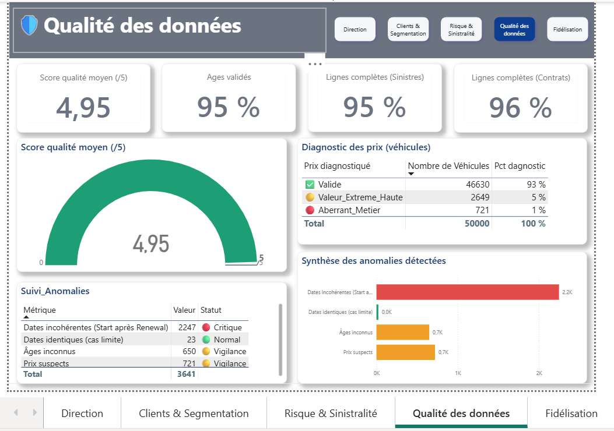
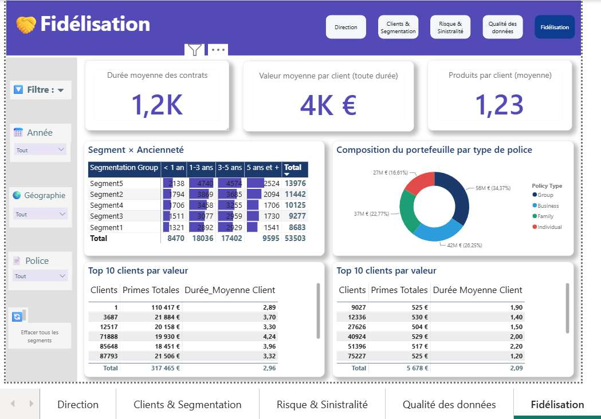

# 🚗 Dashboard BI | Assurance Automobile

**Projet Data Analytics & Business Intelligence : Formation Professionnelle**

Projet Power BI dédié au pilotage de la performance d'une agence d'assurance automobile à travers un dashboard décisionnel de **5 pages**, couvrant la rentabilité, la segmentation clients, la sinistralité, la qualité des données et la fidélisation.

## 📊 Vue d'ensemble

Ce projet transforme **116 503 lignes de données hétérogènes et imparfaites** en un modèle décisionnel structuré permettant d'analyser les principaux leviers de performance d'une activité d'assurance automobile.

### Données analysées

| Source                  |      Volume | Contenu                            |
| ----------------------- | ----------: | ---------------------------------- |
| `insurance_dataset.csv` |      13 000 | Profils d'assurés et sinistres     |
| `car_sales_data.csv`    |      50 000 | Véhicules et prix de vente         |
| `data_synthetic.csv`    |      53 503 | Clients, contrats et comportements |
| **Total**               | **116 503** | **3 sources hétérogènes**          |

L'objectif principal est de démontrer une démarche complète de **Data Analytics et Business Intelligence** : audit des données, nettoyage, modélisation, création de mesures DAX, visualisation et interprétation métier.

## 🎯 Problématique métier

> Comment transformer plusieurs jeux de données hétérogènes et imparfaits en un tableau de bord décisionnel fiable permettant de piloter une activité d'assurance automobile ?

Le modèle permet notamment de suivre :

* la rentabilité technique ;
* la sinistralité ;
* la qualité des données ;
* la structure et la valeur du portefeuille clients ;
* la fidélisation ;
* les anomalies nécessitant une investigation.

### Principes de pilotage

**Profit technique**

`Primes − Sinistres`

**Loss Ratio**

`Sinistres / Primes`

**Marge technique**

`(Primes − Sinistres) / Primes`

**Combined Ratio**

`Loss Ratio + Frais`

Un **Combined Ratio inférieur à 100 %** indique une rentabilité technique avant prise en compte des autres éléments financiers.

## 📈 KPI principaux

| Domaine     | KPI                     | Résultat / cible |
| ----------- | ----------------------- | ---------------: |
| Rentabilité | Profit Technique        |        **42 M€** |
| Rentabilité | Primes                  |       **162 M€** |
| Rentabilité | Marge avant frais       |       **26,2 %** |
| Rentabilité | Combined Ratio          |      **98,81 %** |
| Clients     | Clients actifs 12 mois  |         **23 K** |
| Clients     | Taux mono-équipement    |       **89,2 %** |
| Clients     | Prime moyenne           |       **≈ 3 K€** |
| Sinistres   | Sinistres exceptionnels |          **938** |
| Sinistres   | Coût moyen              |       **≈ 9 K€** |
| Sinistres   | Coût médian             |       **≈ 6 K€** |
| Qualité     | Score qualité moyen     |     **4,95 / 5** |
| Qualité     | Âges valides            |         **95 %** |
| Qualité     | Complétude sinistres    |         **95 %** |
| Qualité     | Complétude contrats     |         **96 %** |

## 🏗️ Architecture du dashboard

Le rapport Power BI est organisé en **5 pages complémentaires**.

### 1. Direction

**Objectif :** fournir une vision exécutive de la performance.

**Principaux éléments :**

* Profit Technique : **42 M€**
* Primes : **162 M€**
* Marge avant frais : **26,2 %**
* Sinistres exceptionnels : **938**
* Combined Ratio : **98,81 %**
* évolution annuelle des primes ;
* croissance des primes année-sur-année ;
* système d'alertes métier basé sur DAX.


### 2. Clients & Segmentation

**Objectif :** comprendre la structure du portefeuille client.

**Analyses :**

* Clients actifs sur 12 mois : **23 K**
* Taux mono-équipement : **89,2 %**
* Prime moyenne : **≈ 3 K€**
* segmentation en 5 groupes ;
* répartition des clients par tranche d'âge ;
* croisement Segment × Type de police.


### 3. Risque & Sinistralité

**Objectif :** analyser la fréquence et la sévérité des sinistres.

**KPI :**

* coût médian : **≈ 6 K€**
* coût moyen : **≈ 9 K€**
* sinistres exceptionnels : **938**

**Analyses :**

* répartition des coûts par catégorie de sinistre ;
* détail des sinistres exceptionnels ;
* analyse par tranche d'âge ;
* diagnostic des anomalies de données.


### 4. Qualité des Données

**Objectif :** mesurer et surveiller la fiabilité des données utilisées par le modèle.

**KPI :**

* Score qualité moyen : **4,95 / 5**
* Taux d'âge valide : **95 %**
* Complétude sinistres : **95 %**
* Complétude contrats : **96 %**

**Anomalies suivies :**

| Anomalie           |    Volume | Niveau    |
| ------------------ | --------: | --------- |
| Dates incohérentes | **2 247** | Critique  |
| Dates identiques   |    **23** | Normal    |
| Âges inconnus      |   **650** | Vigilance |
| Prix suspects      |   **721** | Vigilance |



### 5. Fidélisation & CRM

**Objectif :** analyser la durée de relation et la valeur du portefeuille.

**KPI :**

* durée moyenne de contrat : **≈ 1 200 jours**
* valeur client : **≈ 4 K€**
* produits moyens : **1,23**

**Analyses :**

* durée de contrat par segment ;
* composition du portefeuille par type de police ;
* Top 10 clients par valeur nette ;
* Bottom 10 clients par valeur nette ;
* comparaison des primes et de la durée moyenne.



## 🔍 Audit et qualité des données

L'audit initial a permis d'identifier plusieurs anomalies avant leur utilisation dans le modèle décisionnel.

| Source      | Anomalie                                 | Traitement                      |
| ----------- | ---------------------------------------- | ------------------------------- |
| `insurance` | Âge sentinelle `102,42` répété 650 fois  | Flag + valeur nulle             |
| `insurance` | 938 montants de sinistres atypiques      | Colonne de flag                 |
| `insurance` | Seulement 3 valeurs d'éducation          | Accepté après contrôle          |
| `car_sales` | 14 doublons exacts                       | Suppression                     |
| `car_sales` | Prix extrême                             | Conservé et diagnostiqué        |
| `synthetic` | Deux formats de dates                    | Correction Power Query          |
| `synthetic` | 2 247 dates incohérentes                 | Flag                            |
| `synthetic` | 23 dates identiques                      | Flag                            |
| Général     | Emojis dans les colonnes qualité         | Détection avec `CONTAINSSTRING` |
| `car_sales` | Prix répartis en 3 niveaux de diagnostic | Classification                  |

**Score qualité initial : 4,7 / 5**

Le nettoyage est volontairement documenté afin de distinguer les données réellement corrigées des anomalies simplement identifiées et conservées pour analyse.

## 🧱 Modèle de données

Le modèle repose sur une architecture en étoile organisée autour de plusieurs tables de faits et dimensions.

### Dimensions

* `Dim_Assuré`
* `Dim_Client`
* `Dim_Segmentation`
* `Dim_Date`

### Tables de faits

* `Fact_Contrats`
* `Fact_Sinistres`
* `Fact_Ventes`

Cette architecture permet de séparer les différents domaines analytiques tout en conservant une structure adaptée aux calculs DAX et à la navigation dans le rapport.

### Limitation structurelle

`Fact_Sinistres` n'est pas reliée à `Dim_Date`.

Par conséquent, la page **Risque & Sinistralité** ne permet pas de produire une évolution temporelle des sinistres à partir du calendrier principal.

Cette limitation est documentée plutôt que masquée dans le modèle.

## 📐 Analyse métier

Le projet ne se limite pas à la production de graphiques. Les indicateurs ont été construits pour répondre à plusieurs problématiques opérationnelles :

### Rentabilité

Le suivi du Profit Technique, du Loss Ratio et du Combined Ratio permet d'évaluer la performance technique du portefeuille.

### Sinistralité

L'identification des sinistres exceptionnels permet de distinguer la fréquence normale des événements présentant un coût inhabituel.

### Qualité

Les indicateurs de complétude, de validité et de cohérence permettent de mesurer la fiabilité du modèle avant l'interprétation des résultats.

### Fidélisation

La durée de contrat, le nombre de produits et la valeur client permettent d'identifier les caractéristiques du portefeuille et les opportunités de développement.

## 🛠️ Stack technique

| Technologie          | Utilisation                   |
| -------------------- | ----------------------------- |
| **Power BI Desktop** | Modélisation et visualisation |
| **Power Query (M)**  | Nettoyage et transformation   |
| **DAX**              | Mesures et indicateurs métier |
| **Excel / CSV**      | Sources de données            |

Le projet comprend **45+ mesures DAX** couvrant notamment :

* rentabilité ;
* sinistralité ;
* segmentation ;
* qualité des données ;
* fidélisation ;
* alertes métier ;
* analyse temporelle.

## 📐 Exemples de mesures DAX

```dax
Primes_Totales =
SUM(Fact_Contrats[Premium Amount])

Sinistres_Totaux =
SUM(Fact_Sinistres[Claim_Amount])

Profit_Technique =
[Primes_Totales] - [Sinistres_Totaux]

Loss_Ratio =
DIVIDE(
    [Sinistres_Totaux],
    [Primes_Totales],
    0
)

Combined_Ratio =
[Loss_Ratio] + 0.25

Marge_Technique =
DIVIDE(
    [Profit_Technique],
    [Primes_Totales],
    0
)
```

Les mesures de qualité utilisent notamment des fonctions comme `CONTAINSSTRING`, tandis que les indicateurs temporels s'appuient sur les fonctions de Time Intelligence de DAX.

## 📁 Structure du projet

```text
assurance-automobile-dashboard/
├── README.md
├── data/
│   ├── insurance_dataset.csv
│   ├── car_sales_data.csv
│   └── data_synthetic.csv
├── screenshots/
│   ├── 01_Direction.jpg
│   ├── 02_Clients_Segmentation.jpg
│   ├── 03_Risque_Sinistralite.jpg
│   ├── 04_Qualite_Donnees.jpg
│   └── 05_Fidelisation_CRM.jpg
├── documentation/
│   └── Documentation_Methodologique.docx
└── assurance-automobile-dashboard.pbix
```

## ▶️ Comment explorer le projet

1. Ouvrir le fichier `assurance-automobile-dashboard.pbix` avec Power BI Desktop.
2. Explorer les cinq pages du rapport.
3. Utiliser les filtres et slicers pour analyser les différents segments.
4. Consulter la page **Qualité des Données** pour comprendre les contrôles effectués.
5. Se référer à la documentation méthodologique pour retrouver les étapes d'audit, de transformation et de modélisation.

Les captures d'écran disponibles dans `screenshots/` permettent également de consulter le rendu du dashboard sans ouvrir Power BI.

## ⚠️ Limitations

* `Fact_Sinistres` n'est pas reliée à `Dim_Date`, empêchant l'analyse temporelle des sinistres sur la page dédiée.
* Les données sources contiennent volontairement plusieurs anomalies utilisées pour démontrer la démarche de Data Quality.
* Certains prix extrêmes sont conservés après diagnostic plutôt que supprimés automatiquement.
* Le Combined Ratio utilise une hypothèse de frais fixée à **25 %**.
* Le modèle est conçu pour l'analyse décisionnelle et non comme un système de gestion opérationnelle de contrats d'assurance.

## 🚀 Axes d'amélioration

* Relier les sinistres à une dimension temporelle adaptée afin d'analyser leur évolution.
* Ajouter une analyse de fréquence et de sévérité par période.
* Construire un véritable score de risque client.
* Développer une segmentation RFM du portefeuille.
* Ajouter des indicateurs de renouvellement et de résiliation.
* Mettre en place une analyse prédictive de la sinistralité.
* Enrichir le suivi de la valeur client avec une approche **Customer Lifetime Value**.
* Automatiser davantage les contrôles de qualité lors du chargement des données.

## 🎓 Compétences démontrées

| Compétence                | Application                                                        |
| ------------------------- | ------------------------------------------------------------------ |
| **Data Quality**          | Audit, détection, classification et suivi des anomalies            |
| **Power Query**           | Nettoyage, transformation et standardisation des sources           |
| **DAX**                   | 45+ mesures de pilotage et indicateurs métier                      |
| **Data Modeling**         | Modèle en étoile avec plusieurs tables de faits                    |
| **Business Intelligence** | Construction d'un dashboard décisionnel de 5 pages                 |
| **Data Analytics**        | Analyse de rentabilité, sinistralité, clients et fidélisation      |
| **Data Storytelling**     | Organisation des indicateurs autour des problématiques métier      |
| **Problem Solving**       | Transformation de données imparfaites en informations exploitables |
