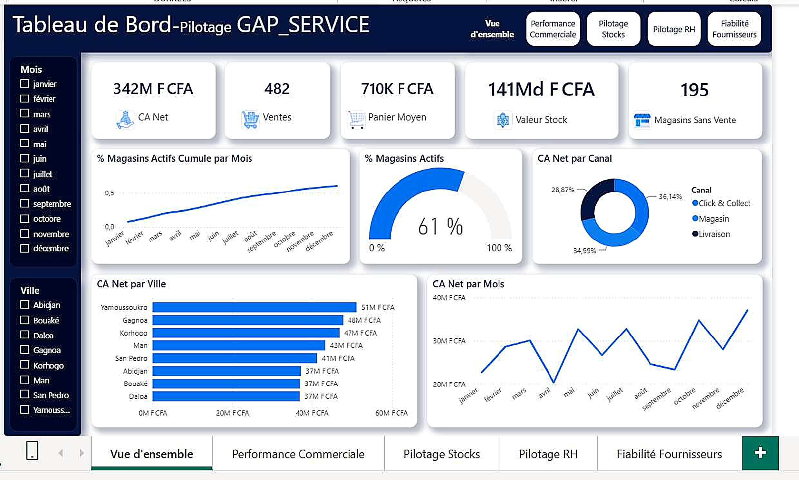
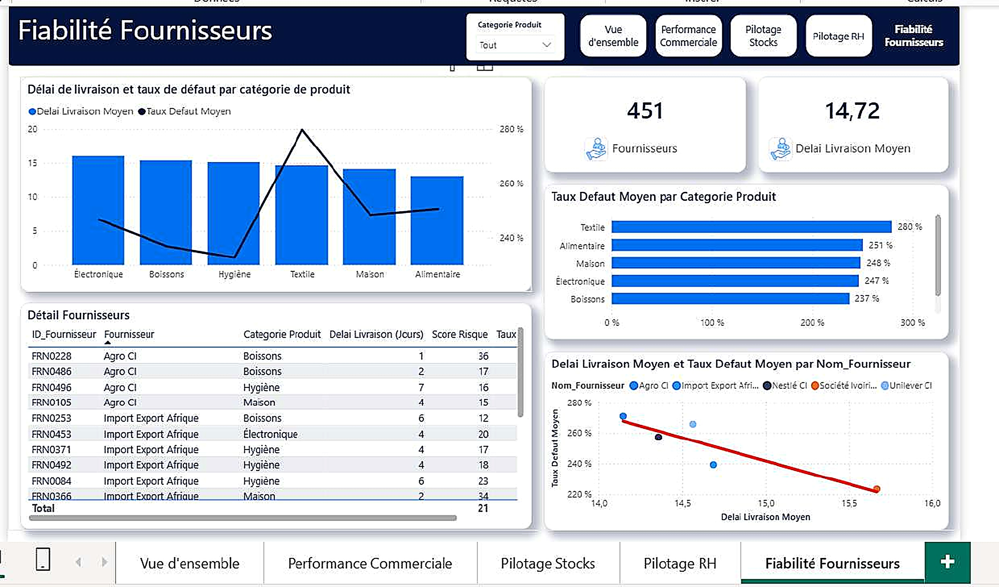

# GAP_SERVICE | Analyse et pilotage d'un réseau retail

## Présentation

GAP_SERVICE est un projet Power BI consacré au suivi d'un réseau de distribution de 500 magasins répartis dans 8 villes de Côte d'Ivoire :

* Abidjan
* Bouaké
* Korhogo
* Yamoussoukro
* San Pedro
* Daloa
* Man
* Gagnoa

Le projet porte sur l'analyse des ventes, des stocks, des ressources humaines et des fournisseurs.

Une attention particulière a été portée à la qualité des données. Les anomalies détectées ont été analysées avant toute modification afin de déterminer si elles correspondaient à une erreur, à une valeur particulière ou à une information qui devait simplement être conservée et isolée.

La démarche suivie est la suivante :

**Observer → Formuler une hypothèse → Vérifier → Décider → Documenter**

---

## Problématique

Avant de présenter les résultats à un responsable ou à un comité de direction, il est nécessaire de vérifier la qualité des données utilisées pour produire les indicateurs.

Le projet cherche donc à répondre à deux besoins :

1. contrôler la qualité des données ;
2. construire un modèle Power BI permettant de suivre les principaux indicateurs du réseau.

---

## Questions d'analyse

Le rapport permet notamment de répondre aux questions suivantes :

* Quel est le chiffre d'affaires total et comment évolue-t-il dans le temps ?
* Quelles villes et quels magasins réalisent les meilleures performances ?
* Quels magasins ne présentent aucune vente enregistrée ?
* Quelle est la valeur du stock par catégorie et par magasin ?
* Quels produits présentent un risque de rupture ?
* Quelle est la masse salariale par ville, magasin et statut ?
* Quels fournisseurs présentent les délais de livraison les plus longs ?
* Quelles catégories de produits présentent les taux de défaut les plus élevés ?

---

## Données

Le projet utilise le fichier :

`GAP_SERVICE_Datasets_Projet_Analyse_AVEC_ERREURS.xlsx`

Le fichier contient cinq tables de 500 lignes chacune :

| Table             | Description                       |
| ----------------- | --------------------------------- |
| `Magasins`        | Informations sur les magasins     |
| `Ventes`          | Transactions commerciales         |
| `Stocks_Produits` | Produits et niveaux de stock      |
| `Employes`        | Informations sur les employés     |
| `Fournisseurs`    | Informations sur les fournisseurs |

La colonne `ID_Magasin` permet de relier les magasins aux tables `Ventes`, `Stocks_Produits` et `Employes`.

La table `Fournisseurs` ne possède pas de clé permettant de la relier directement aux autres tables.

Les contrôles réalisés sur les données ont permis de vérifier les points suivants :

* aucun doublon d'identifiant détecté ;
* aucune ligne strictement dupliquée détectée ;
* 100 % des `ID_Magasin` présents dans les tables concernées existent dans `Magasins`.

---

## Qualité des données

Plusieurs anomalies ont été détectées pendant l'audit.

Elles n'ont pas toutes été traitées de la même manière. La décision dépendait de la nature de l'anomalie et des informations disponibles dans les données.

### Montants de vente négatifs

21 lignes présentent un montant de vente négatif.

Les valeurs vont de `-2 346` à `-47 574 FCFA`.

Les montants positifs se situent entre `6 417` et `1 497 771 FCFA`.

Les valeurs négatives ont été conservées car elles peuvent correspondre à des remboursements ou à des annulations partielles.

Elles sont isolées dans Power BI grâce à plusieurs mesures :

* `CA Net`
* `CA Brut`
* `Total Remboursements`

Aucune modification n'a donc été appliquée directement aux données sources.

### Valeurs physiquement impossibles

Des valeurs négatives ont été détectées dans les colonnes suivantes :

* `Surface_m2`
* `Quantite_Stock`
* `Salaire_Mensuel`
* `Delai_Livraison_Jours`

Les valeurs ont été transformées avec `Number.Abs`.

Cette correction permet de conserver les lignes tout en supprimant le problème de signe.

### Mode de paiement Bitcoin

15 transactions présentent le mode de paiement `Bitcoin`.

Le montant moyen de ces transactions est de 674 388 FCFA.

Les montants observés sont comparables à ceux des autres moyens de paiement :

| Mode de paiement | Montant moyen |
| ---------------- | ------------: |
| Carte            |  745 827 FCFA |
| Espèces          |  667 386 FCFA |
| Mobile Money     |  714 542 FCFA |
| Bitcoin          |  674 388 FCFA |

La catégorie `Bitcoin` a été remplacée par :

`Autre / À vérifier`

La donnée n'a pas été supprimée afin de conserver la trace de l'information originale.

### Valeur sentinelle dans Taux_Defaut_%

18 valeurs sont égales exactement à `150,0 %`.

Une valeur de 150 % n'est pas cohérente avec un taux de défaut classique.

Le fait que les 18 valeurs soient exactement identiques suggère davantage une valeur sentinelle utilisée par le système qu'une série d'erreurs de saisie indépendantes.

Aucune correction automatique n'a donc été appliquée.

---

## Traitement des données

Le nettoyage a été réalisé dans l'ordre suivant :

1. contrôle de la table `Magasins` ;
2. correction des valeurs impossibles ;
3. traitement des valeurs manquantes ;
4. contrôle des clés ;
5. préparation des tables de faits ;
6. création du modèle Power BI.

### Reconstitution de la ville

22 lignes de la table `Magasins` ne contenaient pas de valeur dans `Ville`.

La ville a pu être retrouvée à partir du champ `Nom_Magasin`.

Les noms suivent le format :

`GAP_<Ville>_<numéro>`

La valeur de `Ville` a donc été extraite directement du nom du magasin.

Cette méthode permet de récupérer une information déjà présente dans la ligne sans créer de nouvelle valeur.

Après traitement, les 8 villes du réseau sont correctement identifiées.

---

## Traitement des valeurs manquantes

Certaines valeurs manquantes pouvaient être reconstituées à partir d'autres informations.

Lorsque cela n'était pas possible de manière fiable, les lignes concernées ont été supprimées plutôt que de créer une valeur estimée.

| Table             | Principales anomalies                            | Lignes supprimées |           Résultat |
| ----------------- | ------------------------------------------------ | ----------------: | -----------------: |
| `Magasins`        | Date invalide, surface négative, ville manquante |                 0 |         500 lignes |
| `Ventes`          | Montant manquant                                 |                18 |         482 lignes |
| `Stocks_Produits` | Prix et quantité manquants                       |                34 |         466 lignes |
| `Employes`        | Salaire manquant                                 |                19 |         481 lignes |
| `Fournisseurs`    | Délai manquant, taux supérieur à 100 %           |                49 | Environ 451 lignes |

Les montants négatifs des ventes et les valeurs `Bitcoin` n'ont pas entraîné de suppression de lignes.

---

## Modèle de données

Le modèle Power BI repose principalement sur une structure en étoile.

Les relations principales sont les suivantes :

| Relation                       | Cardinalité     | Filtre |
| ------------------------------ | --------------- | ------ |
| `Magasins` → `Ventes`          | 1 à plusieurs   | Unique |
| `Magasins` → `Stocks_Produits` | 1 à plusieurs   | Unique |
| `Magasins` → `Employes`        | 1 à plusieurs   | Unique |
| `Calendrier` → `Ventes`        | 1 à plusieurs   | Unique |
| `Fournisseurs`                 | Aucune relation |        |

La table `Fournisseurs` reste indépendante du modèle.

Elle partage certaines catégories avec `Stocks_Produits`, mais cette correspondance ne constitue pas une clé de relation fiable.

---

## Table calendrier

Une table calendrier a été créée avec `CALENDAR()` pour couvrir l'année 2024.

Elle contient notamment :

* la date ;
* l'année ;
* le trimestre ;
* le mois ;
* le numéro du mois.

Le numéro du mois permet de conserver l'ordre chronologique lors de l'affichage des mois dans les graphiques.

---

## Mesures DAX

Plusieurs mesures ont été créées pour construire les indicateurs du rapport.

### Panier moyen

La fonction `DIVIDE()` est utilisée afin d'éviter les erreurs lorsqu'aucune vente n'est disponible dans le contexte de filtre.

### CA brut

Le chiffre d'affaires brut correspond aux ventes positives.

### Total remboursements

Les montants négatifs sont isolés puis affichés sous forme positive dans l'indicateur afin de faciliter leur lecture.

### Nombre de ventes

`COUNTROWS()` est utilisé pour compter les lignes de la table de ventes.

### Valeur du stock

La valeur du stock est calculée avec `SUMX()` :

`Prix unitaire × Quantité en stock`

### Magasins sans vente

Une mesure spécifique permet d'identifier les magasins qui ne sont présents dans aucune transaction.

Le résultat obtenu est :

**195 magasins sur 500, soit 39 %.**

Cette information est importante car elle peut avoir un impact sur l'interprétation des indicateurs commerciaux.

---

## Colonnes calculées et mesures

Une distinction a été conservée entre les colonnes calculées et les mesures.

Une colonne calculée est utilisée lorsqu'il s'agit d'une caractéristique propre à une ligne.

Une mesure est utilisée lorsque le résultat doit évoluer en fonction des filtres appliqués dans le rapport.

Par exemple, l'ancienneté d'un magasin est calculée à partir de sa date d'ouverture.

Lorsqu'une date d'ouverture est absente, aucune ancienneté artificielle n'est créée.

---

# Dashboard

## Page 1 : Vue d'ensemble

Cette page présente les principaux indicateurs du réseau.

### KPI

* CA Net : 342 M FCFA
* Ventes : 482
* Panier moyen : 710 K FCFA
* Valeur du stock : 141 Md FCFA
* Magasins sans vente : 195

### Analyses

* évolution du nombre de magasins actifs ;
* pourcentage de magasins actifs ;
* CA Net par canal ;
* CA Net par ville ;
* CA Net par mois.



---

## Page 2 : Performance commerciale

Cette page permet d'analyser les performances commerciales.

### KPI

* Total remboursements : 588 K FCFA
* CA brut : 343 M FCFA

### Analyses

* CA Net par trimestre ;
* CA Net par ville ;
* CA Net par magasin ;
* CA Net par mode de paiement ;
* relation entre surface et chiffre d'affaires ;
* détail des ventes par magasin.

La catégorie `Autre / À vérifier` est conservée dans les analyses afin de rendre visibles les transactions initialement enregistrées comme `Bitcoin`.


---

## Page 3 : Pilotage des stocks

Cette page permet de suivre la valeur des stocks et les produits présentant un risque de rupture.

### KPI

* Valeur du stock : 141 Md FCFA
* Produits en rupture : 44

### Analyses

* valeur du stock par catégorie ;
* produits en rupture par catégorie ;
* valeur du stock par tranche de prix ;
* détail du stock par produit.


---

## Page 4 : Pilotage RH

Cette page présente les principaux indicateurs liés aux employés.

### KPI

* Masse salariale : 305 M FCFA
* Masse salariale par magasin : 611 K FCFA
* Salaire moyen : 635 K FCFA
* Effectif : 481

### Analyses

* masse salariale par ville ;
* effectif par poste ;
* masse salariale par magasin ;
* comparaison masse salariale et CA Net ;
* salaire moyen par statut.

Une anomalie est également signalée dans le rapport :

> Les stagiaires présentent le salaire moyen le plus élevé du réseau, devant les CDI. Cette observation doit être vérifiée avec les données RH avant toute interprétation.


---

## Page 5 : Fiabilité des fournisseurs

Cette page permet de comparer les délais de livraison et les taux de défaut.

### KPI

* Fournisseurs : 451
* Délai moyen de livraison : 14,72 jours

### Analyses

* délai de livraison par catégorie ;
* taux de défaut par catégorie ;
* taux de défaut moyen ;
* détail des fournisseurs ;
* relation entre délai de livraison et taux de défaut.

Le graphique de dispersion permet notamment d'identifier les fournisseurs présentant à la fois un délai élevé et un taux de défaut important.



---

# Principaux résultats

## Performance commerciale

Le chiffre d'affaires brut de Yamoussoukro atteint environ 51,3 M FCFA, devant Abidjan avec environ 37,3 M FCFA.

Cette comparaison doit toutefois tenir compte du nombre de magasins par ville.

Après normalisation du chiffre d'affaires par magasin, Korhogo présente la performance moyenne la plus faible tandis que Gagnoa présente une performance plus élevée par point de vente.

Le nombre de magasins doit donc être pris en compte avant toute comparaison entre les villes.

## Magasins sans vente

195 magasins sur 500 ne présentent aucune vente enregistrée sur la période étudiée.

Cela représente 39 % du réseau.

Deux situations sont possibles :

* ces magasins sont réellement inactifs ;
* les données de ventes disponibles ne couvrent pas l'ensemble du réseau.

Cette situation doit être vérifiée avant de prendre des décisions commerciales importantes à partir du chiffre d'affaires.

## Stocks

44 produits sur 466 présentent un niveau de stock considéré comme faible.

La catégorie Alimentaire représente une part importante de ces produits.

Une surveillance plus fréquente de cette catégorie peut donc être envisagée.

## Ressources humaines

Les stagiaires présentent un salaire moyen supérieur à celui des CDI dans les données analysées.

Cette situation doit être vérifiée auprès du service RH avant toute utilisation de cet indicateur dans une décision.

## Fournisseurs

La catégorie Textile présente à la fois un taux de défaut relativement élevé et des délais de livraison importants.

Cette catégorie peut donc faire l'objet d'une analyse plus approfondie des fournisseurs.

---

# Recommandations

Les principales recommandations issues de l'analyse sont les suivantes :

1. Vérifier l'origine des 195 magasins sans vente enregistrée.
2. Comparer les magasins de Korhogo et de Gagnoa afin d'identifier les différences de performance.
3. Mettre en place un suivi spécifique des stocks de la catégorie Alimentaire.
4. Vérifier les données salariales avec le service RH.
5. Analyser les fournisseurs de la catégorie Textile.
6. Ajouter une information permettant de distinguer les ventes et les remboursements dans la source.

---

# Technologies utilisées

* Power BI Desktop
* Power Query
* DAX
* Modélisation en étoile
* Excel

Principales fonctions DAX utilisées :

`DIVIDE`

`CALCULATE`

`SUMX`

`CALCULATETABLE`

`ALL`

`VALUES`

`SWITCH`

`VAR`

`RETURN`

`DATEDIFF`

---

# Structure du projet

```text
GAP_SERVICE/
│
├── README.md
│
├── screenshots/
│   ├── 01_Vue_ensemble.jpg
│   ├── 02_Performance_commerciale.jpg
│   ├── 03_Pilotage_stocks.jpg
│   ├── 04_Pilotage_RH.jpg
│   └── 05_Fiabilite_fournisseurs.jpg
│
├── documentation/
│   └── GAP_SERVICE_Documentation_Projet_BI.docx
│
├── data/
│   └── GAP_SERVICE_Datasets_Projet_Analyse_AVEC_ERREURS.xlsx
│
└── pbix/
    └── GAP_SERVICE.pbix
```

---

# Limites du projet

Le dataset utilisé est un jeu de données d'exercice contenant volontairement plusieurs anomalies.

Les montants négatifs des ventes ont été conservés car aucune colonne ne permet de distinguer directement les ventes des remboursements.

Les 195 magasins sans vente enregistrée constituent également une limite importante. Il n'est pas possible de déterminer avec les seules données disponibles s'il s'agit de magasins réellement inactifs ou d'un problème de couverture des données.

Certaines valeurs manquantes n'ont pas été imputées lorsqu'aucune méthode fiable ne permettait de les reconstituer.

La table `Fournisseurs` reste indépendante du modèle en raison de l'absence d'une clé de jointure fiable.

---

# Améliorations possibles

Plusieurs évolutions peuvent être envisagées :

* ajouter un champ `Type_Transaction` dans la table des ventes ;
* ajouter une clé `ID_Fournisseur` permettant de relier les fournisseurs aux autres tables ;
* ajouter plusieurs années d'historique ;
* mettre en place des comparaisons entre années ;
* créer un indicateur de risque fournisseur ;
* automatiser l'actualisation des données ;
* connecter le rapport à une source de données opérationnelle.

---

# Compétences démontrées

| Compétence            | Application dans le projet                                            |
| --------------------- | --------------------------------------------------------------------- |
| Data Quality          | Identification et traitement des anomalies avant l'analyse            |
| Power Query           | Nettoyage, transformation et reconstitution de données                |
| DAX                   | Création de mesures et indicateurs dynamiques                         |
| Data Modeling         | Construction d'un modèle en étoile                                    |
| Analyse de données    | Analyse des ventes, stocks, RH et fournisseurs                        |
| Business Intelligence | Création d'un rapport Power BI destiné au pilotage                    |
| Data Storytelling     | Présentation des résultats et des points nécessitant une vérification |
| Problem Solving       | Analyse des anomalies avant correction                                |

---

# Auteur

**Fabrice BOMISSO**

Projet personnel réalisé avec Power BI dans le cadre de mon portfolio Data Analyst.
