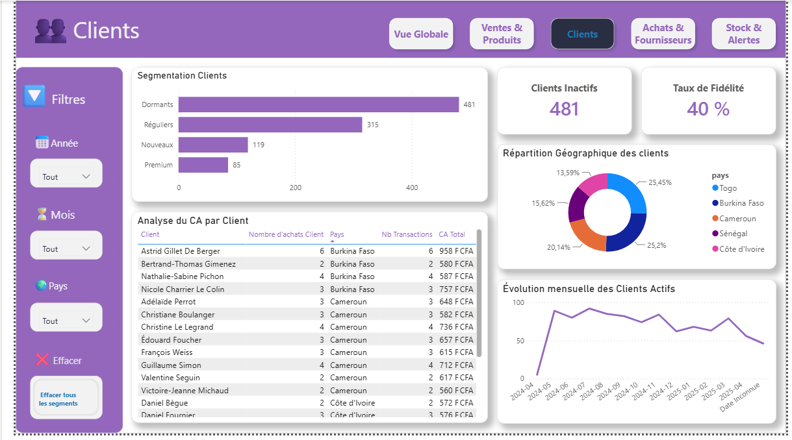

# 🏬 Pilotage Décisionnel d'un Réseau de Distribution Multi-Magasins avec Power BI

Dashboard Power BI de pilotage commercial, financier, client et logistique pour un réseau de distribution multi-sites opérant en Afrique de l'Ouest.

[](https://powerbi.microsoft.com/)
[](https://learn.microsoft.com/dax/)
[](https://learn.microsoft.com/power-query/)
[](#)

---

## 📌 Contexte métier

Ce projet décisionnel a été réalisé pour un réseau de distribution multi-magasins opérant en Afrique de l'Ouest. L'objectif est de mettre en place un reporting Power BI permettant de suivre les performances commerciales, la rentabilité, les clients, les achats et les stocks.

| Élément                | Détail                                                        |
| ----------------------- | -------------------------------------------------------------- |
| Secteur                | Distribution / Commerce de détail multi-sites                 |
| Périmètre géographique | 5 pays : Côte d'Ivoire, Burkina Faso, Togo, Sénégal, Cameroun |
| Réseau                 | 12 magasins                                                   |
| Catalogue              | 100 références produits                                       |
| Base clients           | 1 000 clients enregistrés                                     |
| Période d'analyse      | Janvier 2023 - Décembre 2025                                  |

### Problématiques métier

* Quelle est la performance commerciale par magasin et par pays ?
* Quels produits génèrent le plus de chiffre d'affaires et de marge ?
* Quels magasins présentent des risques de rupture de stock ?
* Quels sont les clients les plus importants ?
* Comment évoluent les ventes au fil du temps ?
* Les volumes d'achat sont-ils cohérents avec la demande ?

---

## 🗂️ Sources de données

Le projet repose sur 4 fichiers CSV :

| Fichier       | Rôle                          | Lignes | Colonnes |
| ------------- | ------------------------------ | -----: | -------: |
| `ventes.csv`  | Transactions de ventes        |  1 000 |        8 |
| `achats.csv`  | Bons de commande fournisseurs |  1 000 |        8 |
| `clients.csv` | Référentiel clients           |  1 000 |        9 |
| `stock.csv`   | Niveaux de stock par magasin  |    600 |        5 |

### Qualité des données

Les données ont été préparées dans Power Query :

* Normalisation des différents formats de date avec `try...otherwise`
* Recalcul des prix et coûts unitaires lorsque les valeurs étaient nulles
* Remplacement des fournisseurs manquants par `Fournisseur Inconnu`
* Suppression des colonnes sans valeur analytique, notamment l'email et le téléphone

Principe appliqué : **ne pas remplacer une valeur manquante par une valeur inventée.**

---

## ⭐ Modèle de données

Le modèle utilise une structure en étoile avec 3 tables de faits et 4 dimensions.

### Tables de faits

* `Fact_Ventes` : 1 000 lignes
* `Fact_Achats` : 1 000 lignes
* `Fact_Stock` : 600 lignes

### Dimensions

* `Dim_Date` : 1 096 lignes
* `Dim_Magasins` : 12 lignes
* `Dim_Produits` : 100 lignes
* `Dim_Clients` : 1 000 lignes

La relation `Dim_Clients → Dim_Magasins` a été désactivée afin d'éviter les chemins ambigus vers `Fact_Ventes`. Elle peut être utilisée ponctuellement avec `USERELATIONSHIP()`.

Les mesures DAX sont regroupées dans une table dédiée appelée `_Mesures`.

---

## 🧮 Mesures DAX

| Mesure              | Formule                                                            | Utilisation             |
| -------------------- | -------------------------------------------------------------------- | ------------------------- |
| CA Total            | `SUMX(Fact_Ventes, [quantité] * [prix_unitaire])`                  | KPI principal           |
| Marge Brute         | `[CA Total] - [Coût Total Achats]`                                 | Rentabilité             |
| Taux de Marge       | `DIVIDE([Marge Unitaire], [Prix moyen vente], 0)`                  | Performance commerciale |
| Croissance MoM      | `DIVIDE([CA Total] - [CA Mois Précédent], [CA Mois Précédent], 0)` | Évolution mensuelle     |
| Nb Clients Actifs   | `DISTINCTCOUNT(Fact_Ventes[id_client])`                            | Suivi de la clientèle   |
| Produits en Rupture | `COUNTROWS(FILTER(Fact_Stock, [quantité] = 0))`                    | Alerte stock            |

`DIVIDE()` est utilisé pour gérer les divisions par zéro. `SUMX()` permet d'effectuer les calculs ligne par ligne lorsque cela est nécessaire.

Le modèle comprend 15 mesures ainsi que plusieurs colonnes calculées pour la segmentation :

* `Segment Client`
* `Tranche Prix`
* `Statut Stock`

Les segmentations utilisent notamment `SWITCH(TRUE())`.

---

## 📊 Dashboard Power BI

Le rapport contient 5 pages.

### 1. Vue Globale

**Vision 360° du réseau**


La page présente les principaux indicateurs :

* CA Total
* Marge Unitaire
* Transactions
* Clients Actifs
* Croissance MoM
* CA par magasin
* Évolution mensuelle du CA
* Répartition du CA par pays
* Top produits

### 2. Ventes & Produits

**Analyse de la performance commerciale**


La page permet d'analyser :

* Top 10 produits par CA
* CA par produit
* Quantités vendues
* Marge
* Évolution mensuelle des ventes
* Répartition des ventes par tranche de prix

### 3. Clients

**Analyse et segmentation de la clientèle**



La page présente :

* Segmentation Premium / Régulier / Nouveaux / Dormants
* Taux de fidélité
* Répartition des clients par pays
* CA par client
* Évolution des clients actifs

### 4. Achats & Fournisseurs

**Suivi des approvisionnements**


La page permet de suivre :

* Coût total par fournisseur
* Répartition des achats par catégorie
* Nombre de commandes
* Performance des fournisseurs
* Évolution des achats

### 5. Stock & Alertes

**Suivi des stocks et identification des risques**


La page présente :

* Stock total
* Produits en rupture
* Produits en stock critique
* Stock par magasin
* Ancienneté des réapprovisionnements

---

## 💡 Principaux résultats

### Concentration du chiffre d'affaires

4 magasins génèrent près de 40 % du chiffre d'affaires total. Le Magasin 7 représente à lui seul environ 12 % du CA.

Cette concentration permet d'identifier les magasins les plus performants et d'étudier leurs pratiques afin de les reproduire dans les points de vente moins performants.

### Marge brute

La marge brute atteint 36 %. Les produits présentant une marge inférieure à 25 % constituent un axe d'analyse pour identifier les possibilités d'amélioration de la rentabilité.

### Clients inactifs

Sur les 1 000 clients enregistrés, 629 ont effectué au moins un achat. Une partie importante de la base client reste donc inactive et constitue une cible pour les campagnes de réactivation.

### Ruptures de stock

24 produits sont en rupture de stock et plus de 60 produits sont considérés comme critiques.

Ces indicateurs permettent d'identifier rapidement les besoins de réapprovisionnement.

### Répartition géographique

Le Burkina Faso représente 27,5 % de la base clients, devant le Togo avec 23,9 %.

La Côte d'Ivoire reste moins représentée dans la base clients malgré son importance dans le périmètre géographique étudié.

---

## 🎯 Recommandations

| Priorité      | Action                                                                 |
| -------------- | ------------------------------------------------------------------------ |
| 🔴 Urgent     | Réapprovisionner les 24 produits en rupture de stock                   |
| 🔴 Urgent     | Alerter les magasins sur les 60 produits en stock critique             |
| 🟡 Important  | Mettre en place une campagne de réactivation des clients inactifs      |
| 🟡 Important  | Identifier les pratiques des magasins les plus performants             |
| 🟢 Recommandé | Identifier et promouvoir les produits avec une marge supérieure à 40 % |

---

## 🛠️ Compétences techniques

### Power Query (M)

* Nettoyage et transformation des données
* Normalisation des formats
* Gestion des valeurs nulles
* Création des dimensions
* Extraction et déduplication

### Modélisation

* Schéma en étoile
* Relations entre tables
* Gestion des relations actives et inactives
* Résolution des chemins ambigus
* Organisation des mesures

### DAX

* Time Intelligence
* Croissance MoM et YoY
* `DIVIDE`
* `SUMX`
* `CALCULATE`
* `FILTER`
* `SWITCH(TRUE())`

### Data visualisation

* Conception de 5 pages Power BI
* KPI
* Filtres et segments
* Navigation entre les pages
* Mise en forme conditionnelle
* Visualisation des performances commerciales, clients, achats et stocks

### Data storytelling

* Analyse des performances
* Identification des écarts
* Mise en évidence des risques
* Identification des opportunités
* Formulation de recommandations à partir des données

---

## 📁 Organisation du projet

```text
Pilotage Décisionnel d'un Réseau de Distribution Multi-Magasins avec Power BI/
│
├── Data/
│   ├── ventes.csv
│   ├── achats.csv
│   ├── clients.csv
│   └── stock.csv
│
├── Documentation/
│   └── Pilotage_Décisionnel_d'un_Réseau_de_Distribution_Multi-Magasins_avec_Power_BI.pdf
│
├── screenshots/
│   ├── Achat & Fournisseur.png
│   ├── Clients.png
│   ├── Stock & Alerte.png
│   ├── Vente - Produit.png
│   └── Vue Globale.png
│
├── Pilotage Décisionnel d'un Réseau de Distribution Multi-Magasins avec Power BI.pbix
│
└── README.md
```

---

## 📄 Documentation

La documentation complète du projet comprend :

* Le contexte métier
* Le dictionnaire de données
* Les transformations Power Query
* Le modèle de données
* Le catalogue des mesures DAX
* Le guide d'utilisation du dashboard

Elle est disponible dans le dossier `Documentation/`.

---

## 📌 Statut

**Projet finalisé**

Le fichier Power BI, les données utilisées, les transformations Power Query, les mesures DAX, la documentation et les captures des différentes pages du dashboard sont disponibles dans ce répertoire.
