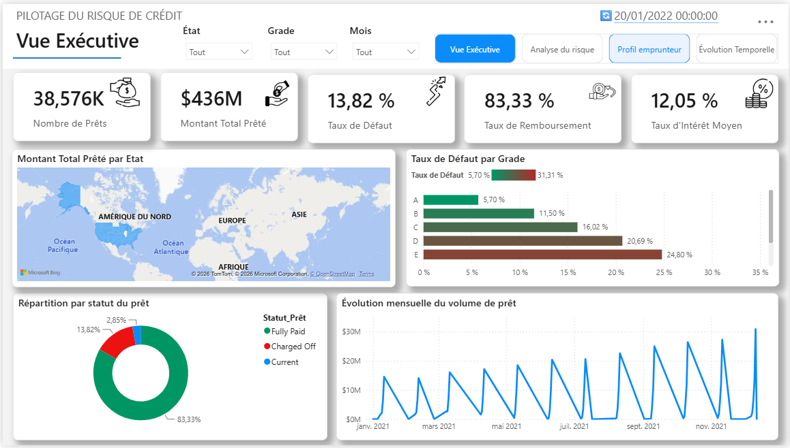
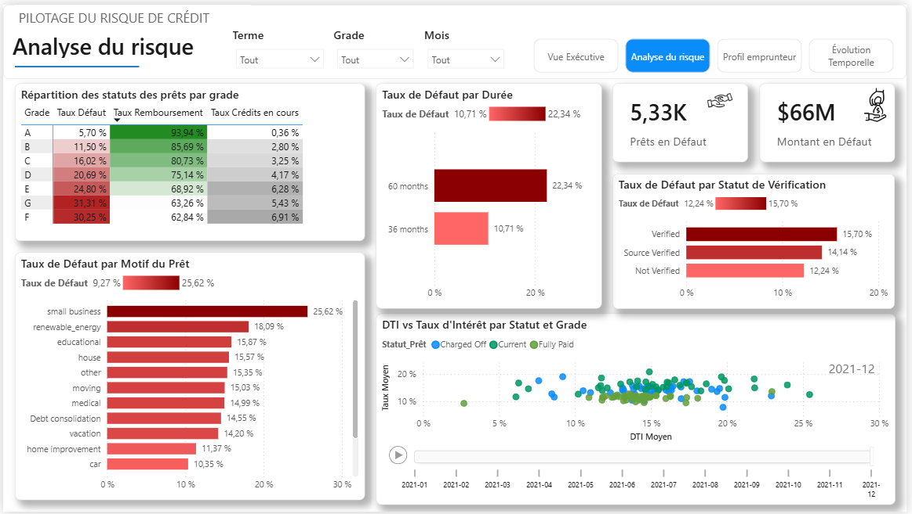
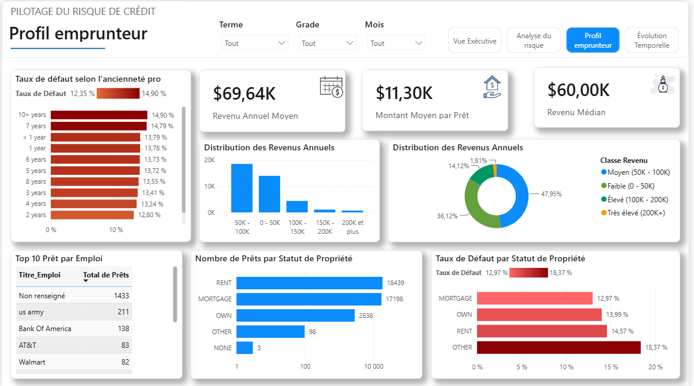

# 💳 Pilotage du Risque de Crédit | Analyse de Prêts Bancaires

## 🎯 Objectif

Construire un dashboard Power BI dédié au **pilotage du risque de crédit**.

L'objectif est de permettre à une institution financière de suivre la santé de son portefeuille de prêts à travers plusieurs indicateurs :

* le volume de prêts accordés ;
* les montants prêtés et remboursés ;
* le taux de défaut ;
* le taux de remboursement ;
* le taux d'intérêt ;
* le profil des emprunteurs ;
* les caractéristiques des prêts ;
* l'évolution des principaux indicateurs dans le temps.

L'analyse cherche également à identifier les segments du portefeuille associés aux niveaux de risque les plus élevés.

---

## 🧩 Contexte métier

Le projet porte sur l'analyse d'un portefeuille de **38 576 contrats de prêt** répartis dans **50 États américains**.

Les données permettent d'étudier les caractéristiques des prêts, leur statut, leur grade de risque, leur motif, leur durée, les informations relatives aux emprunteurs ainsi que plusieurs dates liées au cycle de vie des prêts.

Les prêts ont été émis principalement au cours de l'année **2021**. Les données de paiement et de suivi du crédit s'étendent jusqu'en **janvier 2022**.

L'année 2021 constitue donc la principale période d'analyse des tendances temporelles.

---

## 🔗 Source de données

Le projet utilise le dataset **Financial Loans Dataset with Facts and Dimensions**, disponible sur Kaggle.

**Source :** [Kaggle - Financial Loans Dataset with Facts and Dimensions](https://www.kaggle.com/datasets/kumbamsaiarjunreddy/financial-loans-dataset-with-facts-and-dimensions)

Le dataset fournit une structure composée de données de faits et de dimensions. Il contient notamment des informations sur les prêts, les emprunteurs, les statuts, les grades, les revenus, les dates, les taux d'intérêt, le DTI et les localisations géographiques.

### Fichiers utilisés

#### `LOANS_FACT.csv`

Table contenant les données quantitatives et transactionnelles relatives aux prêts :

* identifiant du fait ;
* montant du prêt ;
* taux d'intérêt ;
* mensualité ;
* paiement total ;
* ratio dette/revenu ;
* type de demande ;
* identifiant du prêt ;
* identifiant de l'emprunteur ;
* code de l'État ;
* date d'émission ;
* date du dernier paiement ;
* date du prochain paiement ;
* date de dernière consultation du crédit.

#### `LOANS_DIMENSION.csv`

Table contenant les caractéristiques descriptives des prêts :

* Grade ;
* Sous-Grade ;
* Durée ;
* Statut du prêt ;
* Motif du prêt ;
* Statut de vérification.

#### `BORROWER_DIMENSION.csv`

Table contenant les caractéristiques des emprunteurs :

* ancienneté professionnelle ;
* titre ou métier ;
* statut de propriété du logement ;
* revenu annuel.

---

## 🧹 Préparation et contrôle des données

La préparation des données a été réalisée avec **Power Query**.

Les principales étapes sont :

1. importation des fichiers CSV ;
2. promotion des en-têtes ;
3. contrôle et harmonisation des types de données ;
4. contrôle des clés ;
5. vérification des doublons ;
6. vérification des valeurs manquantes ;
7. traduction des noms techniques en noms métier ;
8. jointure des informations relatives aux emprunteurs ;
9. création des clés de dates ;
10. contrôle de la cohérence chronologique des dates.

### Contrôles réalisés

La dimension des prêts contient **3 416 identifiants distincts** sans doublon.

La dimension des États contient **50 États distincts** sans valeur manquante.

La table des emprunteurs contient **38 576 `BORROWER_ID` distincts**, sans doublon ni valeur manquante.

Dans le dataset fourni, chaque `BORROWER_ID` apparaît une seule fois dans la table des emprunteurs et une seule fois dans la table de faits.

La relation observée est donc **1:1** avec les données disponibles.

Sur le plan métier, un emprunteur peut toutefois avoir plusieurs prêts. Dans un système bancaire réel, la relation serait alors **1:N** si plusieurs contrats étaient associés au même emprunteur.

---

## ⭐ Modélisation en schéma en étoile

Le modèle final repose sur un **schéma en étoile**.

La table centrale est :

`Faits_Prêts_Modèle`

Les principales dimensions sont :

* `Dim_Prêt`
* `Dim_État`
* `Dim_Date`

Les informations relatives aux emprunteurs sont intégrées dans la table de faits, car la structure du dataset fourni présente une relation 1:1 entre les emprunteurs et les lignes de faits.

### Pourquoi un schéma en étoile ?

Le schéma en étoile permet de séparer :

* les **faits mesurables** au centre du modèle ;
* les **dimensions descriptives** autour des faits.

Cette organisation facilite :

* la navigation dans les données ;
* la création des mesures DAX ;
* le filtrage des indicateurs ;
* la construction des visualisations ;
* la maintenance du modèle.

Elle permet également de mieux structurer les analyses de risque.

---

## 📅 Gestion des dates

La table `Dim_Date` constitue la dimension calendrier du modèle.

Elle couvre actuellement la période du **1er janvier 2021 au 20 janvier 2022**.

Elle contient notamment :

* Date ;
* DateKey ;
* Année ;
* Trimestre ;
* Mois ;
* Numéro du mois ;
* Année-Mois ;
* Jour ;
* Numéro du jour de la semaine ;
* Jour de la semaine.

La table de faits contient plusieurs dates :

* date d'émission ;
* date du dernier paiement ;
* date du prochain paiement ;
* date de dernière consultation du crédit.

La **date d'émission** est utilisée comme relation active avec `Dim_Date`.

Les autres relations sont inactives.

Elles peuvent être activées dans les mesures DAX avec `USERELATIONSHIP()` lorsque l'analyse porte sur une autre date.

Cette approche permet notamment d'analyser les remboursements selon la date du dernier paiement tout en conservant la date d'émission comme relation temporelle principale.

---

## 📊 KPIs principaux

| KPI                    | Ce qu'il mesure                                          |     Résultat |
| ---------------------- | -------------------------------------------------------- | -----------: |
| Montant Total Prêté    | Volume total du portefeuille                             |   **436 M$** |
| Nombre Total de Prêts  | Nombre total de contrats                                 |   **38 576** |
| Montant Moyen par Prêt | Taille moyenne d'un contrat                              | **11,30 K$** |
| Taux de Défaut         | Part des prêts en statut Charged Off                     |  **13,82 %** |
| Taux de Remboursement  | Part des prêts en statut Fully Paid                      |  **83,33 %** |
| Taux d'Intérêt Moyen   | Taux d'intérêt moyen du portefeuille                     |  **12,05 %** |
| DTI Moyen              | Ratio dette/revenu moyen                                 |  **13,33 %** |
| Revenu Annuel Moyen    | Revenu annuel moyen des emprunteurs                      | **69,64 K$** |
| Revenu Médian          | Revenu annuel médian                                     | **60,00 K$** |
| Montant en Défaut      | Montant associé aux prêts Charged Off                    |    **66 M$** |
| Prêts en Défaut        | Nombre de prêts Charged Off                              |   **5,33 K** |
| Croissance Mensuelle   | Évolution du montant prêté par rapport au mois précédent | **+13,04 %** |

---

## 🔍 Analyses réalisées

### 1. Vue Exécutive

Cette page fournit une vision globale du portefeuille.

Elle permet de suivre :

* le nombre total de prêts ;
* le montant total prêté ;
* le taux de défaut ;
* le taux de remboursement ;
* le taux d'intérêt moyen ;
* la répartition des prêts par statut ;
* le taux de défaut selon le grade ;
* la répartition géographique du portefeuille ;
* l'évolution mensuelle du volume de prêts.

### 2. Analyse du risque

Cette page permet d'identifier les segments présentant les niveaux de risque les plus élevés.

Une matrice **Grade × Statut du prêt** permet de comparer :

* le taux de défaut ;
* le taux de remboursement ;
* le taux de crédits en cours.

Le taux de défaut augmente fortement avec le grade :

* Grade A : **5,70 %**
* Grade B : **11,50 %**
* Grade C : **16,02 %**
* Grade D : **20,69 %**
* Grade E : **24,80 %**
* Grade F : **30,25 %**
* Grade G : **31,31 %**

L'analyse porte également sur :

* la durée du prêt ;
* le motif du prêt ;
* le statut de vérification ;
* le DTI ;
* le taux d'intérêt.

### 3. Profil emprunteur

Cette page analyse les caractéristiques des emprunteurs.

Elle permet notamment d'étudier :

* le revenu annuel moyen ;
* le revenu médian ;
* la distribution des revenus ;
* le statut de propriété du logement ;
* l'ancienneté professionnelle ;
* les métiers représentés ;
* le taux de défaut selon le profil de l'emprunteur.

La classe de revenu **50K-100K$** représente **47,95 %** des emprunteurs.

La classe **0-50K$** représente **36,12 %**.

### 4. Évolution Temporelle

Cette page analyse l'évolution des indicateurs sur la période disponible.

Elle présente notamment :

* le montant prêté par mois ;
* le montant remboursé par mois ;
* le nombre de prêts par mois ;
* la croissance mensuelle ;
* le taux de défaut mensuel ;
* le taux d'intérêt moyen mensuel.

La mesure de croissance mensuelle compare des **mois entiers** afin d'éviter les biais liés à une comparaison entre des journées présentant des niveaux d'activité différents.

---

## 🧮 Mesures DAX

Plusieurs mesures DAX ont été développées pour répondre aux besoins d'analyse.

### Taux de défaut

Le taux de défaut correspond au nombre de prêts en statut `Charged Off` rapporté au nombre total de prêts.

Résultat sur l'ensemble du portefeuille : **13,82 %**.

### Taux de remboursement

Le taux de remboursement correspond à la proportion de prêts en statut `Fully Paid`.

Résultat : **83,33 %**.

### Taux d'intérêt moyen

Le taux d'intérêt moyen est calculé à partir de la colonne `Taux_Intérêt`.

Résultat : **12,05 %**.

### Croissance mensuelle

La croissance mensuelle compare le montant prêté du mois courant avec celui du mois précédent.

La comparaison est effectuée sur des mois complets.

Le résultat validé pour décembre 2021 par rapport à novembre 2021 est de **+13,04 %**.

### Montant remboursé selon la date du dernier paiement

La mesure utilise `USERELATIONSHIP()` pour activer la relation entre la date du dernier paiement et la dimension calendrier.

Cette approche permet d'analyser les remboursements selon leur date de paiement.

---

## ⚠️ Contrôles et corrections

### Relation avec Borrower

Dans le dataset fourni, chaque `BORROWER_ID` apparaît une seule fois dans la table des emprunteurs et une seule fois dans la table de faits.

La relation observée est donc **1:1**.

Cette structure ne signifie pas qu'un emprunteur ne peut jamais avoir plusieurs prêts dans un système bancaire.

Elle reflète uniquement la structure du dataset utilisé.

Dans un système bancaire réel, plusieurs contrats pourraient être associés au même emprunteur. La relation serait alors **1:N**.

### Relations avec la dimension Date

Plusieurs dates sont présentes dans la table de faits.

La relation avec la date d'émission est active.

Les relations avec les autres dates sont inactives et sont utilisées avec `USERELATIONSHIP()` lorsque nécessaire.

### Correction de l'affichage des mois

Un problème d'affichage regroupait auparavant **juin et juillet** sous une même valeur.

La colonne des mois a été corrigée afin de distinguer correctement :

* juin ;
* juil.

Les résultats temporels ont ensuite été contrôlés.

---

## 🧠 Insights clés

### 1. Le risque augmente avec le grade

Le taux de défaut passe de **5,70 % pour le grade A** à **31,31 % pour le grade G**.

Les grades F et G présentent donc les taux de défaut les plus élevés du portefeuille.

### 2. Les prêts de 60 mois présentent davantage de défauts

Le taux de défaut atteint **22,34 % pour les prêts de 60 mois**, contre **10,71 % pour les prêts de 36 mois**.

### 3. Le motif Small Business présente le taux de défaut le plus élevé

Le motif `small business` présente un taux de défaut de **25,62 %**.

Il est suivi par `renewable_energy` avec **18,09 %**.

### 4. Le portefeuille est principalement composé d'emprunteurs aux revenus intermédiaires

La classe **50K-100K$** représente **47,95 %** des emprunteurs.

La classe **0-50K$** représente **36,12 %**.

### 5. Le volume de prêts progresse au cours de 2021

Le montant prêté augmente globalement entre le début et la fin de l'année 2021.

Cette évolution s'accompagne toutefois de variations mensuelles du taux de défaut. Celui-ci reste globalement compris entre environ **11,5 % et 15 %** selon les mois.

---

## 🛠️ Technologies utilisées

* **Power BI Desktop** : modélisation, visualisation et reporting.
* **Power Query (M)** : importation, nettoyage, transformation et contrôle des données.
* **DAX** : création des mesures, calculs temporels, ratios et analyses du risque.

### Principales fonctions DAX utilisées

* `CALCULATE`
* `COUNTROWS`
* `SUM`
* `AVERAGE`
* `MEDIAN`
* `DIVIDE`
* `DATEADD`
* `TOTALYTD`
* `USERELATIONSHIP`
* `SWITCH`
* `FILTER`

---

## 🖼️ Aperçu du dashboard

Le rapport comprend **4 pages**, chacune répondant à une question métier spécifique.

### Vue Exécutive

Cette page permet d'obtenir rapidement une vision globale de l'état du portefeuille.

Elle comprend les principaux KPIs, la répartition des prêts par statut, le taux de défaut par grade, la répartition géographique du montant prêté et l'évolution du volume de prêts.



### Analyse du Risque

Cette page permet d'identifier les segments présentant les niveaux de risque les plus élevés.

Elle présente une matrice Grade × Statut, le taux de défaut selon le motif du prêt et le statut de vérification ainsi qu'un nuage de points DTI vs taux d'intérêt.



### Profil Emprunteur

Cette page permet d'analyser les caractéristiques des emprunteurs.

Elle présente le revenu annuel moyen et médian, la distribution des revenus, le taux de défaut selon le statut de propriété et l'ancienneté professionnelle ainsi que le Top 10 des métiers représentés.



### Évolution Temporelle

Cette page permet d'analyser les principales tendances observées au cours de la période disponible.

Elle présente le montant prêté et le montant remboursé par mois, la croissance mensuelle, l'évolution du taux de défaut et le taux d'intérêt moyen mensuel.


> ℹ️ Les captures montrent une vue filtrée du dashboard. Le bandeau « Données à jour au 31/07/2023 » visible sur certaines captures provient d'un gabarit initial et ne correspond pas à la couverture réelle du dataset. Les données utilisées couvrent principalement l'année 2021 et s'étendent jusqu'en janvier 2022 pour certaines dates de suivi.

---

## 📂 Contenu du dossier

```text
pilotage-risque-credit-bancaire/

├── README.md

├── data/
│   ├── LOANS_FACT.csv
│   ├── LOANS_DIMENSION.csv
│   └── BORROWER_DIMENSION.csv

├── screenshots/
│   ├── 01-vue-executive.jpg
│   ├── 02-analyse-du-risque.jpg
│   ├── 03-profil-emprunteur.jpg
│   └── 04-evolution-temporelle.jpg

├── documentation/
│   └── Corrections_Projet_BI.docx

└── Dashboard Analyse de Crédit Bancaire.pbix
```

---

## 📌 Conclusion

Ce projet met en œuvre une démarche complète de **Business Intelligence appliquée au risque de crédit**.

La démarche couvre :

**Besoin métier → Collecte des données → Nettoyage → Contrôle qualité → Modélisation → Schéma en étoile → DAX → Visualisation → Analyse des résultats.**

Le dashboard permet ainsi de transformer les données brutes en indicateurs exploitables pour le suivi du portefeuille et l'identification des principaux segments de risque.
